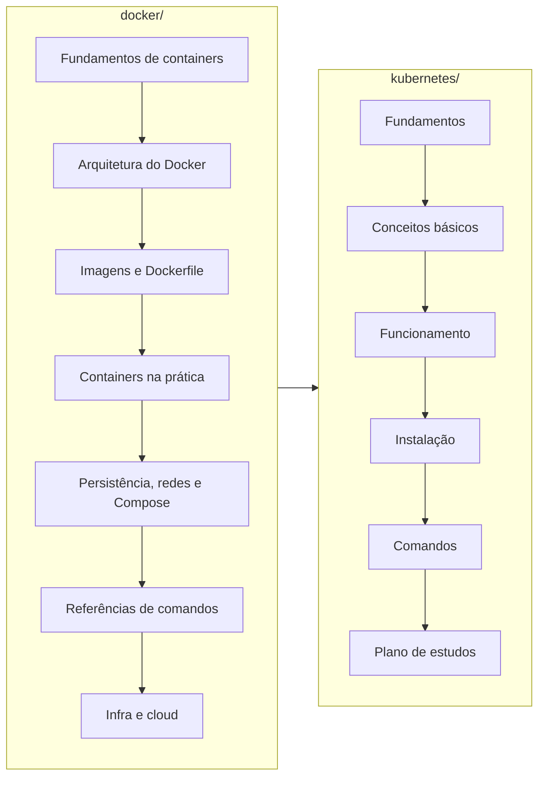

# Meus estudos em Docker e Kubernetes

Repositório de anotações pessoais sobre containers e orquestração, organizado como uma trilha de estudo progressiva: primeiro **Docker** (fundamentos de containers), depois **Kubernetes** (orquestração em escala). O material foi escrito para servir de consulta rápida, revisão e guia de prática no terminal.

## Estrutura do repositório

| Pasta | Conteúdo | Ponto de partida |
| --- | --- | --- |
| [`docker/`](./docker/) | Trilha completa de Docker: containers vs. VMs, arquitetura (Client, Daemon, Engine, registries), imagens e Dockerfile, ciclo de vida de containers, volumes, redes, Docker Compose, referência de comandos e integração com cloud (AWS Elastic Beanstalk) | [README da trilha Docker](./docker/README.md) |
| [`kubernetes/`](./kubernetes/) | Trilha de introdução ao Kubernetes: por que orquestração e arquitetura do cluster; Pods, Workloads, Services/Ingress, ConfigMap/Secret, Volumes/PV/PVC, Namespaces e Labels; auto healing, escalabilidade e deploy sem downtime; formas de instalação (local e profissional); kubectl essencial com colunas explicadas; e plano de aprofundamento com certificações | [README da trilha Kubernetes](./kubernetes/README.md) |

## Ordem de estudo recomendada

1. **Docker primeiro.** Kubernetes orquestra containers; sem entender imagem, container, volume e rede no Docker, os conceitos do Kubernetes não fazem sentido. Siga a ordem numerada dos arquivos em `docker/`.
2. **Kubernetes em seguida.** A trilha em `kubernetes/` assume a base de Docker e segue a ordem das pastas numeradas (`01-fundamentos` até `06-plano-de-estudos`). Cada arquivo termina com o link para o próximo passo.

## Convenções das anotações

Todos os arquivos das trilhas seguem o mesmo formato:

- **Objetivo no topo**: o que aquele arquivo responde;
- **Analogias do cotidiano**: cada conceito técnico é ancorado em um exemplo do dia a dia (restaurante, prédio comercial, frota de táxis etc.);
- **Diagramas Mermaid**: fluxogramas, diagramas de sequência e de estados renderizados direto no GitHub/IDE;
- **Imagens oficiais embutidas**: os diagramas da documentação do Kubernetes aparecem direto nas notas via link público, sem necessidade de captura manual;
- **Checklist de compreensão**: perguntas ao final de cada arquivo; só avançar quando conseguir responder todas;
- **Referências oficiais**: links para a documentação canônica de cada tema.

## Ferramentas usadas na prática

| Ferramenta | Para quê | Onde é apresentada |
| --- | --- | --- |
| Docker Engine / Docker Desktop | Construir e rodar containers | `docker/` |
| Docker Compose | Orquestração local de múltiplos containers | `docker/05-persistencia-redes-e-compose.md` |
| kubectl | Cliente oficial do Kubernetes (obrigatório em qualquer cenário) | `kubernetes/05-comandos/` |
| minikube / kind | Clusters Kubernetes locais para estudo | `kubernetes/04-instalacao/` |
| eksctl / EKS | Kubernetes gerenciado na AWS para uso profissional | `kubernetes/04-instalacao/` |

## Status

- [x] Trilha Docker: anotações completas e revisadas
- [x] Trilha Kubernetes: introdução completa (fundamentos, conceitos, funcionamento, instalação, comandos e plano de estudos)
- [ ] Executar os projetos práticos da Fase 2 do [plano de aprofundamento](./kubernetes/06-plano-de-estudos/01-plano-de-aprofundamento.md)
