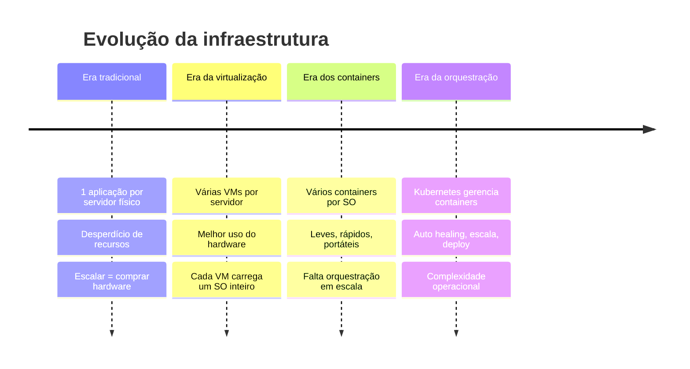
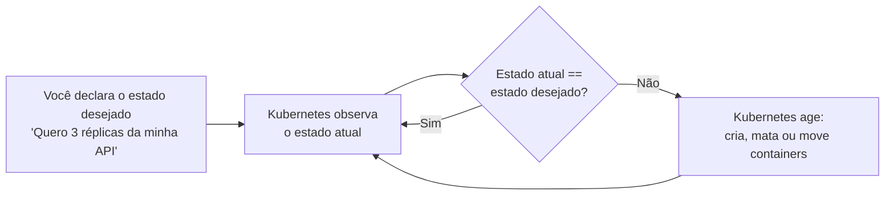
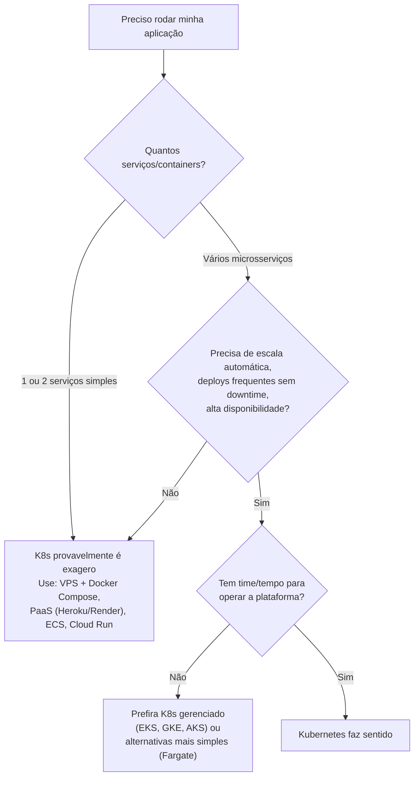

# Por que Kubernetes?

> **Objetivo deste arquivo:** responder às perguntas essenciais antes de tocar em qualquer comando:
> Por que não usar apenas servidores físicos? Por que não usar apenas Docker? O que é Kubernetes, qual problema ele resolve, quanto custa mantê-lo e quando ele (não) faz sentido?

---

## 1. A evolução: do servidor físico ao orquestrador

### Analogia do cotidiano

Pense em **moradia**:

- **Servidor físico** = casa própria: você paga tudo (terreno, obra, manutenção), e se precisar de mais espaço, precisa construir outra casa inteira.
- **Máquina virtual (VM)** = prédio de apartamentos: várias famílias no mesmo terreno, mas cada apartamento tem cozinha, banheiro e mobília completos (sistema operacional inteiro duplicado).
- **Container** = quarto em um coliving: cada morador tem seu espaço isolado, mas cozinha, lavanderia e internet são compartilhadas (o kernel do sistema operacional). Muito mais leve e rápido de "mudar".
- **Kubernetes** = a **administradora do coliving em escala nacional**: decide em qual unidade cada morador entra, realoca quem estava numa unidade que pegou fogo, abre novas unidades quando a demanda cresce e fecha quando esvazia.

*Diagrama oficial "Container Evolution" — [documentação do Kubernetes](https://kubernetes.io/pt-br/docs/concepts/overview/).*

### Por que não utilizar apenas servidores físicos?

| Problema | Consequência |
|---|---|
| Recursos subutilizados | Um servidor rodando a 10% de CPU custa o mesmo que a 90% |
| Escalar é lento e caro | Comprar, instalar e configurar hardware leva semanas |
| Falha de hardware = aplicação fora do ar | Sem redundância automática |
| Conflito de dependências | Duas aplicações que exigem versões diferentes de uma biblioteca no mesmo SO |

### Por que não utilizar apenas Docker?

O Docker resolve o **empacotamento e a execução** de containers em **uma máquina**. Ele **não resolve** o que acontece quando você tem dezenas de containers em dezenas de máquinas:

- Se um container morre às 3h da manhã, **quem o reinicia**?
- Se o tráfego triplica, **quem cria mais réplicas** e distribui a carga entre elas?
- Se um servidor inteiro cai, **quem move os containers** dele para outro servidor?
- Como atualizar a aplicação **sem derrubar** os usuários conectados?
- Como containers em **máquinas diferentes** se encontram e conversam?

**Analogia:** Docker é como saber pilotar **um avião**. Kubernetes é a **torre de controle do aeroporto**, coordenando centenas de voos, pistas, pousos e decolagens ao mesmo tempo.

---

## 2. O que é Kubernetes e qual problema ele resolve?

**Kubernetes (K8s)** é uma plataforma **open source de orquestração de containers**, criada pelo Google (baseada na experiência interna com o sistema Borg) e hoje mantida pela **CNCF** (Cloud Native Computing Foundation).

> O nome vem do grego *κυβερνήτης* = "timoneiro" (quem pilota o navio). Por isso o logo é um **leme**. E "K8s" = K + 8 letras + s.

O problema central que ele resolve: **manter o estado desejado das suas aplicações, automaticamente**.

Esse ciclo se chama **reconciliation loop** (loop de reconciliação) e é o coração de tudo: você **declara o que quer** (modelo declarativo), e o Kubernetes trabalha continuamente para chegar lá — como um **termostato**: você define 22 °C e ele liga/desliga o ar-condicionado sozinho para manter.

### O que ele realmente faz por baixo dos panos?

- **Scheduling:** decide em qual máquina cada container roda (como um corretor de imóveis achando o melhor apartamento disponível).
- **Auto healing:** reinicia containers que falham e realoca os de máquinas que caíram.
- **Service discovery e load balancing:** dá nomes e IPs estáveis para grupos de containers e distribui o tráfego entre eles.
- **Rollouts e rollbacks:** atualiza versões gradualmente e volta atrás se algo der errado.
- **Escalabilidade horizontal:** aumenta/diminui o número de réplicas conforme a demanda.
- **Gestão de configuração e segredos:** injeta configurações e senhas nos containers sem rebuildar imagens.

*(cada item desses tem um arquivo dedicado nas pastas `02-conceitos-basicos/` e `03-funcionamento/`)*

---

## 3. Custos e complexidades de manter Kubernetes

Kubernetes **não é grátis** — mesmo sendo open source, o custo está em **operação e pessoas**:

| Dimensão | Custo/Complexidade |
|---|---|
| **Curva de aprendizado** | Íngreme: dezenas de conceitos novos (Pods, Services, Ingress, RBAC...) |
| **Operação do Control Plane** | Upgrades, backup do etcd, certificados, alta disponibilidade |
| **Observabilidade** | Você precisa montar logging, métricas e tracing (Prometheus, Grafana...) |
| **Segurança** | RBAC, Network Policies, gestão de secrets, imagens vulneráveis |
| **Custo financeiro** | Nós do control plane + workers rodando 24/7; um cluster gerenciado tem taxa fixa (ex.: EKS ≈ US$ 0,10/hora por cluster) |
| **Time** | Em produção séria, exige pessoas dedicadas a plataforma/DevOps |

### Quando Kubernetes faz sentido — e quando não faz

**Regra de bolso:** se o seu problema cabe em um `docker compose up` em um servidor só, você ainda não precisa de Kubernetes. Kubernetes brilha quando há **muitos serviços, muitas máquinas e necessidade de automação**.

---

## 4. Quais opções existem na AWS?

| Opção | O que é | Você gerencia | Quando usar |
|---|---|---|---|
| **EKS (Elastic Kubernetes Service)** | Kubernetes gerenciado: a AWS opera o control plane | Apenas os worker nodes (ou nem isso, com Fargate) | Quer Kubernetes "de verdade" sem operar o control plane |
| **EKS + Fargate** | EKS onde os Pods rodam em infra serverless | Quase nada de infraestrutura | Não quer gerenciar servidores de forma alguma |
| **Self-managed em EC2** | Você instala o Kubernetes (kubeadm etc.) em instâncias EC2 | **Tudo**: control plane, etcd, upgrades | Controle total, requisitos muito específicos, aprendizado |
| **ECS (Elastic Container Service)** | Orquestrador de containers **proprietário** da AWS, mais simples que K8s | Menos peças, integração nativa com AWS | Quer orquestração mais simples e não precisa do ecossistema K8s |
| **App Runner / Lambda** | Abstrações ainda maiores (deploy direto do código/imagem) | Praticamente nada | Serviços pequenos, APIs simples, eventos |
---

## Checklist de compreensão

Antes de avançar para a arquitetura, você deve conseguir responder com suas palavras:

- [ ] Qual a diferença entre VM e container?
- [ ] Cite 3 problemas que o Docker sozinho não resolve.
- [ ] O que significa "modelo declarativo" e "estado desejado"?
- [ ] Dê um exemplo de cenário em que Kubernetes **não** vale a pena.
- [ ] Qual a diferença entre EKS e ECS?

## Referências oficiais

- [O que é Kubernetes? (docs oficiais, em português)](https://kubernetes.io/pt-br/docs/concepts/overview/)
- [Caso de negócio: por que containers e orquestração (CNCF)](https://www.cncf.io/)
- [Amazon EKS — documentação oficial](https://docs.aws.amazon.com/eks/latest/userguide/what-is-eks.html)
- [Comparativo de serviços de containers na AWS](https://aws.amazon.com/pt/containers/)
- [Borg, Omega, and Kubernetes (paper do Google sobre a origem)](https://research.google/pubs/pub44843/)

## Próximo passo

Siga para [`02-arquitetura-cluster.md`](./02-arquitetura-cluster.md) para entender **as peças** que formam um cluster Kubernetes.
