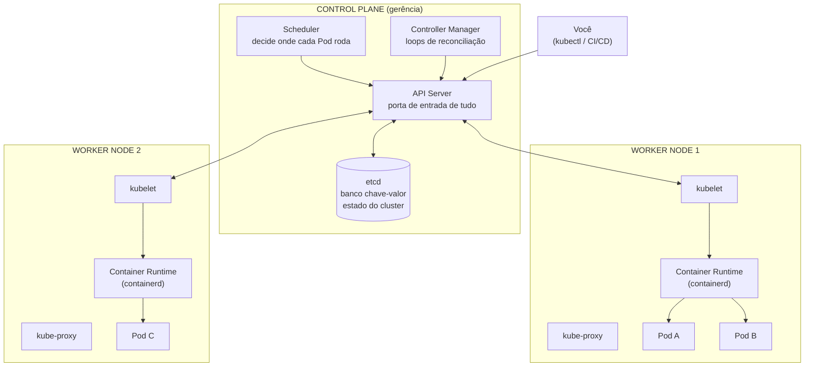
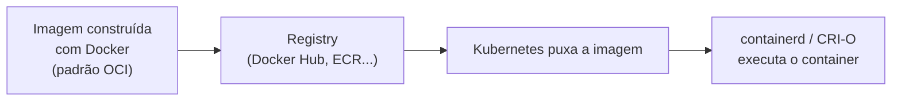
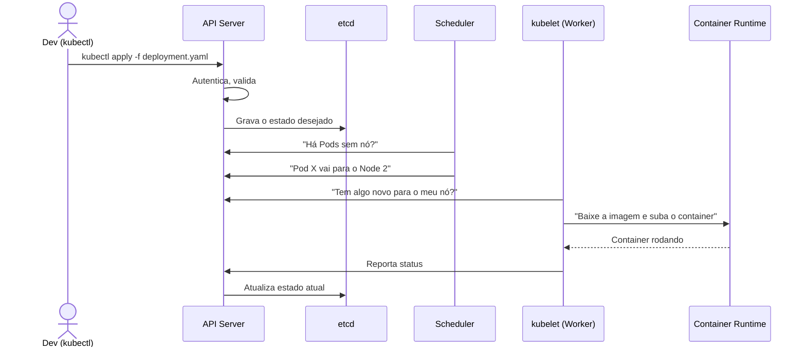

# Arquitetura de um Cluster Kubernetes

> **Objetivo deste arquivo:** entender as peças físicas e lógicas do cluster: **Cluster, Node, Control Plane, Worker Node, Container Runtime** e os componentes internos (**API Server, Scheduler, Controller Manager, etcd, kubelet, kube-proxy**).

---

## 1. Visão geral: a analogia do restaurante

Imagine um **restaurante grande**:

| Kubernetes | Restaurante |
|---|---|
| **Cluster** | O restaurante inteiro (cozinha + salão + gerência) |
| **Control Plane** | A **gerência**: recebe pedidos, decide qual cozinheiro faz o quê, monitora tudo |
| **Worker Node** | Cada **estação da cozinha**, onde a comida (containers) é de fato preparada |
| **API Server** | O **balcão de pedidos**: TUDO passa por ele — garçons, gerentes, clientes |
| **etcd** | O **caderno de registros**: pedidos, receitas e o estado de cada mesa |
| **Scheduler** | O **chefe de cozinha**: decide qual estação prepara cada prato conforme a carga |
| **Controller Manager** | Os **supervisores**: circulam conferindo se cada pedido está saindo como registrado |
| **kubelet** | O **cozinheiro chefe de cada estação**: recebe a ordem e garante que o prato seja feito |
| **Container Runtime** | O **fogão/forno**: o equipamento que efetivamente executa (containerd, CRI-O) |
| **kube-proxy** | Os **garçons**: levam a comunicação/tráfego até o lugar certo |

## 2. Diagrama do cluster

*Diagrama oficial "Components of Kubernetes" — [documentação do Kubernetes](https://kubernetes.io/pt-br/docs/concepts/overview/components/). Versão simplificada do cluster, para comparar com o diagrama acima:*

---

## 3. Cada peça em detalhe

### Cluster
O conjunto completo: **Control Plane + Worker Nodes**. É a unidade que você "cria" quando sobe um Kubernetes (no EKS, no minikube etc.).

### Node
Uma **máquina** (física ou VM) que faz parte do cluster. Existem dois papéis:

- **Control Plane Node:** roda os componentes de gerência.
- **Worker Node:** roda as suas aplicações (os Pods).

> Em ambientes de estudo (minikube, kind) uma única máquina acumula os dois papéis. Em produção, o control plane costuma ter 3+ nós para alta disponibilidade.

### Control Plane — os 4 componentes

| Componente | Função | Analogia |
|---|---|---|
| **kube-apiserver** | Único ponto de entrada. Valida e processa TODAS as requisições (kubectl, kubelet, controllers). Expõe a API REST | Balcão de pedidos |
| **etcd** | Banco de dados chave-valor distribuído que guarda **todo** o estado do cluster. Se o etcd se perde sem backup, o cluster se perde | Caderno de registros do restaurante |
| **kube-scheduler** | Observa Pods recém-criados sem nó definido e escolhe o melhor nó para cada um, considerando CPU/memória disponíveis, afinidades e restrições | Chefe de cozinha distribuindo pratos |
| **kube-controller-manager** | Executa os *controllers*: loops que comparam estado atual × desejado e corrigem (Node controller, ReplicaSet controller, Job controller...) | Supervisores em ronda constante |

### Worker Node — os 3 componentes

| Componente | Função |
|---|---|
| **kubelet** | Agente que roda em cada nó. Conversa com o API Server, recebe a especificação dos Pods e garante que os containers deles estejam rodando e saudáveis |
| **kube-proxy** | Mantém regras de rede no nó para que o tráfego destinado a um Service chegue aos Pods certos (mais em `02-conceitos-basicos/03-rede-services-ingress.md`) |
| **Container Runtime** | Software que efetivamente baixa imagens e executa containers. Hoje o padrão é **containerd** (o Docker Engine foi descontinuado como runtime do K8s a partir da v1.24, mas as **imagens Docker continuam 100% compatíveis**, pois seguem o padrão OCI) |

### Container Runtime: e o Docker?

**Resumo:** você continua **construindo** imagens com Docker; o Kubernetes apenas as **executa** com outro runtime por baixo. Nada muda no seu fluxo de build.

---

## 4. O que acontece quando você cria uma aplicação? (fluxo completo)

Esse fluxo mostra um princípio importante: **os componentes não conversam diretamente entre si — tudo passa pelo API Server**, e cada componente age observando mudanças.

---

## Checklist de compreensão

- [ ] Qual a diferença entre Control Plane e Worker Node?
- [ ] Por que o etcd é o componente mais crítico para backup?
- [ ] Qual componente decide **onde** um Pod roda?
- [ ] Qual componente garante que os containers de um nó estão rodando?
- [ ] "O Kubernetes deixou de suportar Docker" — o que essa frase realmente significa?

## Referências oficiais

- [Componentes do Kubernetes (docs oficiais, em português)](https://kubernetes.io/pt-br/docs/concepts/overview/components/)
- [Arquitetura do cluster](https://kubernetes.io/docs/concepts/architecture/)
- [etcd — documentação oficial](https://etcd.io/docs/)
- [containerd](https://containerd.io/)
- [Dockershim removal FAQ (a história do Docker como runtime)](https://kubernetes.io/blog/2022/02/17/dockershim-faq/)

## Próximo passo

Siga para [`../02-conceitos-basicos/01-pods-e-containers.md`](../02-conceitos-basicos/01-pods-e-containers.md) para conhecer a menor unidade do Kubernetes: o **Pod**.
