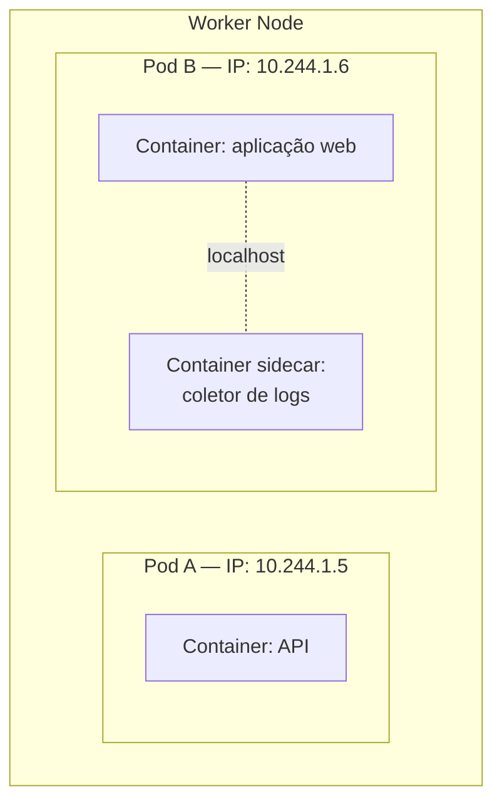
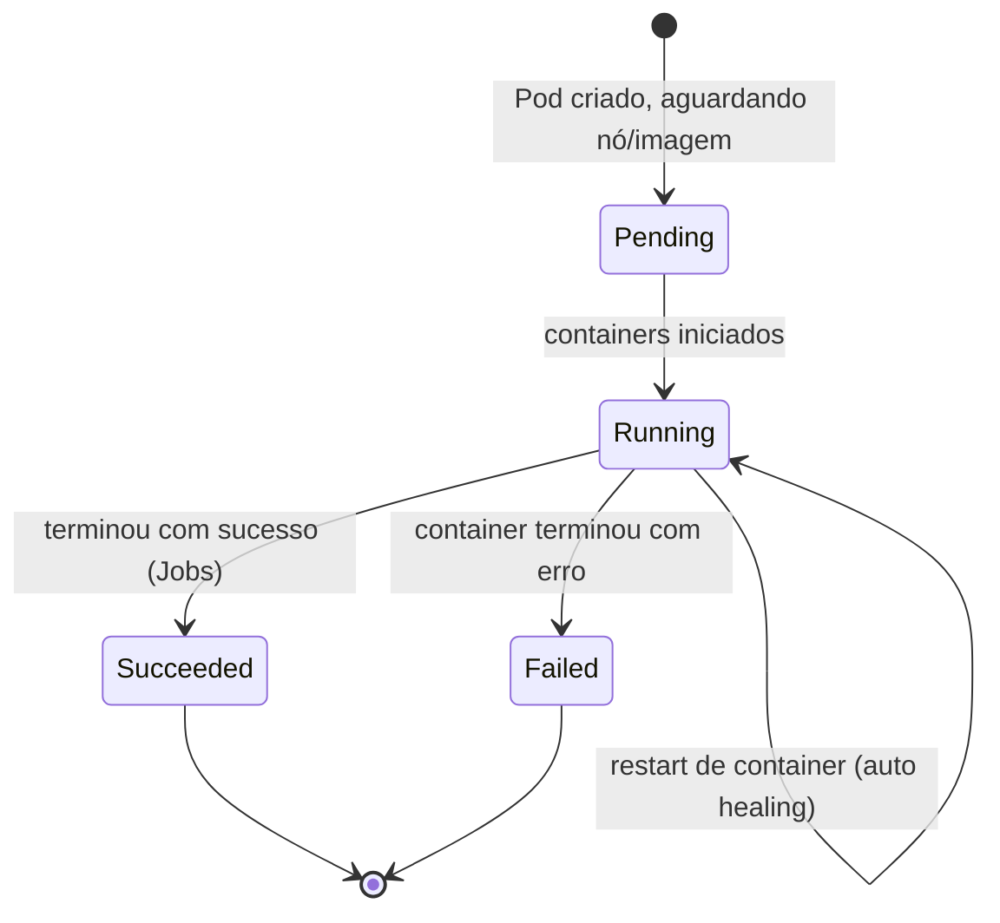

# Pods e Containers

> **Objetivo deste arquivo:** entender o que é um **Pod**, como ele se relaciona com **containers** e por que o Kubernetes não gerencia containers diretamente.

---

## 1. Container (recapitulando)

Um **container** é um processo isolado que empacota a aplicação com tudo o que ela precisa (binários, bibliotecas, configurações), compartilhando o kernel do sistema operacional do host.

**Analogia:** um container é uma **marmita completa** — a refeição vem pronta com todos os itens, do mesmo jeito, não importa onde você a abra (sua casa, o trabalho, uma viagem). "Funciona na minha máquina" deixa de ser problema.

## 2. Pod: a menor unidade do Kubernetes

O Kubernetes **nunca cria um container solto**. A menor unidade que ele cria e gerencia é o **Pod**: um "envelope" que contém **um ou mais containers** que compartilham:

- **Rede:** mesmo IP e mesmas portas (containers do mesmo Pod se falam via `localhost`);
- **Volumes:** podem compartilhar diretórios;
- **Ciclo de vida:** nascem e morrem juntos, sempre no mesmo nó.

**Analogia:** o Pod é o **apartamento**, e os containers são os **moradores**. Moradores do mesmo apartamento dividem o mesmo endereço (IP), a mesma geladeira (volumes) e se falam gritando de um cômodo para o outro (`localhost`). Se o apartamento é demolido, todos saem juntos.



### Um container por Pod (o caso comum) vs. múltiplos

- **Regra geral:** **1 container por Pod**. Cada Pod roda uma instância da sua aplicação.
- **Exceção — sidecars:** containers auxiliares no mesmo Pod, ex.: um coletor de logs, um proxy de service mesh (Istio). É o "morador de apoio" que vive junto porque precisa do mesmo endereço.

## 3. Características importantes do Pod

### Pods são efêmeros (descartáveis)

Mentalidade **"gado, não animal de estimação"** (*cattle, not pets*): você não dá nome nem apego a um Pod. Ele pode morrer e ser substituído por outro **idêntico, mas novo** (novo IP, novo nome) a qualquer momento.

Consequências práticas:

- Nunca guarde dados importantes dentro do Pod (veja `04-configuracao-e-storage.md`);
- Nunca aponte para o IP de um Pod diretamente (veja `03-rede-services-ingress.md` — para isso existem Services);
- Você quase nunca cria Pods "na mão": usa **Workloads** (Deployment etc. — veja `02-workloads.md`) que criam e recriam Pods por você.

### Ciclo de vida de um Pod



| Fase | Significado |
|---|---|
| `Pending` | Aceito pelo cluster, mas ainda sem nó atribuído ou baixando imagem |
| `Running` | Vinculado a um nó, ao menos um container rodando |
| `Succeeded` | Todos os containers terminaram com sucesso (comum em Jobs) |
| `Failed` | Ao menos um container terminou com erro |
| `Unknown` | O cluster perdeu contato com o nó do Pod |

## 4. Exemplo mínimo de manifesto (YAML)

```yaml
apiVersion: v1
kind: Pod
metadata:
  name: meu-primeiro-pod
  labels:
    app: nginx
spec:
  containers:
    - name: nginx
      image: nginx:1.27
      ports:
        - containerPort: 80
```

Anatomia de **todo** manifesto Kubernetes (decore estes 4 campos):

| Campo | O que é |
|---|---|
| `apiVersion` | Versão da API do recurso (`v1`, `apps/v1`...) |
| `kind` | Tipo do recurso (`Pod`, `Deployment`, `Service`...) |
| `metadata` | Nome, namespace, labels, annotations |
| `spec` | A especificação: **o estado desejado** daquele recurso |


*Diagrama oficial do tutorial "Kubernetes Basics": Pods com seus containers, volumes e IPs. Abaixo, como os Pods se distribuem dentro de um Node:*


> A explicação de cada coluna do `kubectl get pods` está em [`../05-comandos/01-kubectl-essencial.md`](../05-comandos/01-kubectl-essencial.md).

---

## Checklist de compreensão

- [ ] Por que o Kubernetes gerencia Pods e não containers?
- [ ] O que dois containers do mesmo Pod compartilham?
- [ ] O que significa dizer que Pods são efêmeros? Cite 2 consequências práticas.
- [ ] Quando faz sentido ter mais de um container no mesmo Pod?

## Referências oficiais

- [Pods (docs oficiais, em português)](https://kubernetes.io/pt-br/docs/concepts/workloads/pods/)
- [Ciclo de vida do Pod](https://kubernetes.io/docs/concepts/workloads/pods/pod-lifecycle/)
- [Padrão sidecar](https://kubernetes.io/docs/concepts/workloads/pods/sidecar-containers/)

## Próximo passo

Você quase nunca cria Pods diretamente. Siga para [`02-workloads.md`](./02-workloads.md) e conheça os **Workloads** que os gerenciam.
