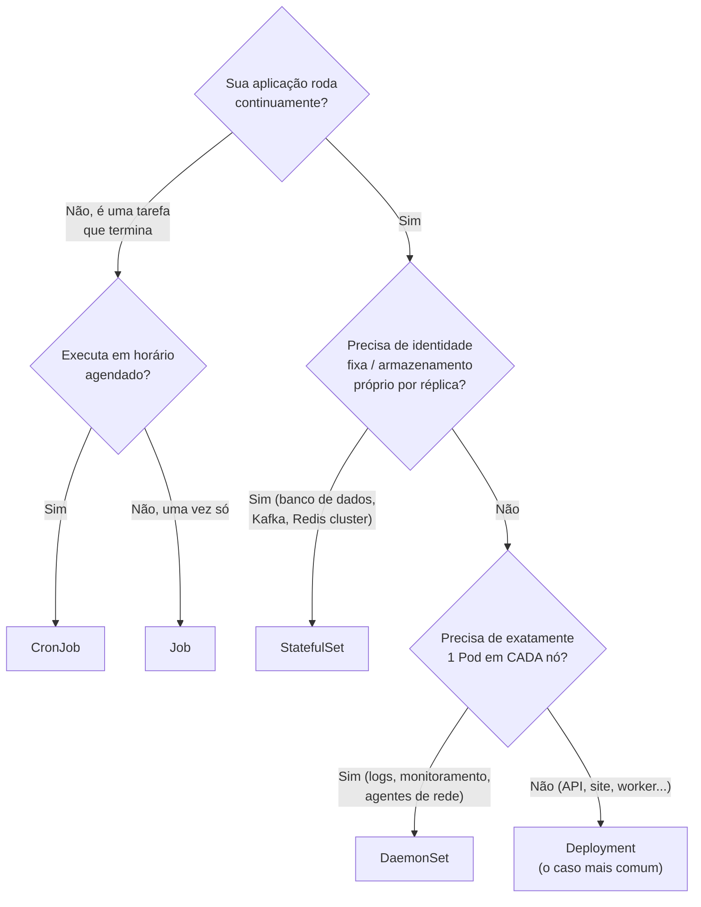
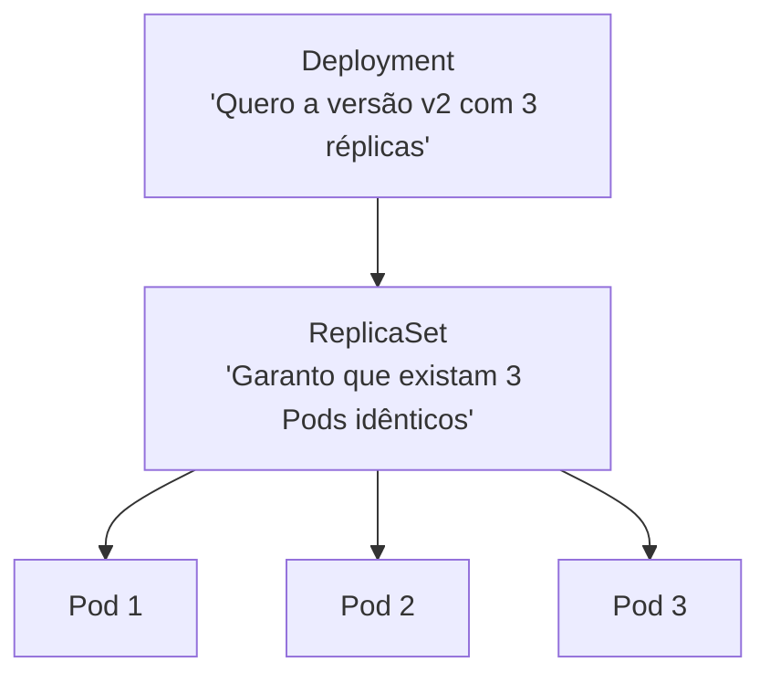

# Workloads: Deployment, ReplicaSet, StatefulSet, DaemonSet, Job e CronJob

> **Objetivo deste arquivo:** conhecer os recursos que **criam e gerenciam Pods** por você — cada um resolvendo um tipo diferente de carga de trabalho.

---

## 1. Por que Workloads existem?

Como visto em [`01-pods-e-containers.md`](./01-pods-e-containers.md), Pods são efêmeros. Se você criar um Pod "na mão" e ele morrer, **ninguém o recria**. Os Workloads são os "gerentes" que garantem que os Pods certos existam, na quantidade certa, o tempo todo.



## 2. Deployment + ReplicaSet (o par mais usado)

### A hierarquia



- **ReplicaSet:** garante que exista o número desejado de Pods idênticos. Se um morre, cria outro.
- **Deployment:** gerencia ReplicaSets e adiciona **versionamento e atualizações** (rolling update, rollback).

**Analogia:** o Deployment é o **RH da empresa** definindo "o time de atendimento precisa de 3 pessoas no turno, treinadas no manual v2". O ReplicaSet é o **supervisor de turno**: se alguém falta, chama um substituto imediatamente. Quando o manual muda para a v3, o RH monta um novo turno gradualmente (novo ReplicaSet) enquanto desmonta o antigo.

**Na prática você cria Deployments, nunca ReplicaSets diretamente** — o Deployment cria e gerencia os ReplicaSets por baixo.

### Exemplo de manifesto

```yaml
apiVersion: apps/v1
kind: Deployment
metadata:
  name: minha-api
spec:
  replicas: 3
  selector:
    matchLabels:
      app: minha-api
  template: # <- o "molde" dos Pods
    metadata:
      labels:
        app: minha-api
    spec:
      containers:
        - name: api
          image: minha-api:v2
          ports:
            - containerPort: 8080
```

## 3. StatefulSet — aplicações com estado

Para aplicações onde **cada réplica é única e precisa manter identidade**: bancos de dados (PostgreSQL, MySQL), Kafka, Elasticsearch...

Diferenças em relação ao Deployment:

| | Deployment | StatefulSet |
|---|---|---|
| Nome dos Pods | Aleatório (`api-7f9d-x2k1`) | Estável e ordenado (`db-0`, `db-1`, `db-2`) |
| Armazenamento | Compartilhado/nenhum | **Um volume persistente próprio por Pod** |
| Ordem de criação | Todos ao mesmo tempo | Sequencial (`db-0` antes de `db-1`) |
| Identidade de rede | Efêmera | DNS estável por Pod |

**Analogia:** Deployment é um time de **caixas de supermercado** — qualquer caixa atende qualquer cliente, tanto faz qual. StatefulSet é um time de **médicos com seus consultórios e fichários próprios** — o Dr. `db-0` tem os prontuários dele; se ele sai, o substituto assume **o mesmo consultório e o mesmo fichário**.

## 4. DaemonSet — um Pod em cada nó

Garante **exatamente um Pod em cada nó do cluster** (novos nós recebem o Pod automaticamente). Usos típicos: coletor de logs (Fluentd), agente de monitoramento (node-exporter), plugin de rede.

**Analogia:** o **extintor de incêndio** — não importa quantos andares o prédio tenha, **todo andar** precisa ter o seu. Construiu um andar novo? Instala-se um extintor nele automaticamente.

## 5. Job e CronJob — tarefas que terminam

- **Job:** roda Pods até a tarefa **completar com sucesso** (ex.: migração de banco, processamento de um lote de arquivos). Se falhar, tenta de novo até o limite configurado.
- **CronJob:** cria Jobs em **agendamento** no formato cron (ex.: `0 3 * * *` = todo dia às 3h). Usos: backups, relatórios, limpezas.

**Analogia:** Job é a **faxina de mudança** — faz uma vez, terminou, acabou. CronJob é a **diarista agendada** — toda sexta às 8h, uma nova "faxina" (Job) é criada.

```yaml
apiVersion: batch/v1
kind: CronJob
metadata:
  name: backup-diario
spec:
  schedule: "0 3 * * *" # todo dia às 03:00
  jobTemplate:
    spec:
      template:
        spec:
          containers:
            - name: backup
              image: meu-backup:latest
          restartPolicy: OnFailure
```

## 6. Tabela-resumo

| Workload | Garante | Exemplo do cotidiano | Caso de uso típico |
|---|---|---|---|
| **Deployment** | N réplicas idênticas + atualização sem downtime | RH mantendo o turno completo | APIs, sites, workers |
| **ReplicaSet** | N réplicas idênticas (usado pelo Deployment) | Supervisor repondo faltas | Não usar diretamente |
| **StatefulSet** | Réplicas com identidade e disco próprios | Médicos com consultório fixo | Bancos de dados, Kafka |
| **DaemonSet** | 1 Pod por nó | Extintor em cada andar | Logs, monitoramento, rede |
| **Job** | Tarefa executa até completar | Faxina de mudança | Migrações, processamento em lote |
| **CronJob** | Jobs em agendamento | Diarista às sextas | Backups, relatórios |


*Diagrama oficial do tutorial "Kubernetes Basics": um Deployment instruindo o cluster a criar e manter os Pods da aplicação.*
---

## Checklist de compreensão

- [ ] Por que não criar Pods diretamente?
- [ ] Qual a relação entre Deployment, ReplicaSet e Pod?
- [ ] Quando usar StatefulSet em vez de Deployment?
- [ ] Dê 2 exemplos reais de uso de DaemonSet.
- [ ] Qual a diferença entre Job e CronJob?

## Referências oficiais

- [Workloads (docs oficiais)](https://kubernetes.io/docs/concepts/workloads/)
- [Deployments](https://kubernetes.io/docs/concepts/workloads/controllers/deployment/)
- [StatefulSets](https://kubernetes.io/docs/concepts/workloads/controllers/statefulset/)
- [DaemonSet](https://kubernetes.io/docs/concepts/workloads/controllers/daemonset/)
- [Jobs](https://kubernetes.io/docs/concepts/workloads/controllers/job/) e [CronJob](https://kubernetes.io/docs/concepts/workloads/controllers/cron-jobs/)

## Próximo passo

Os Pods existem, mas como acessá-los? Siga para [`03-rede-services-ingress.md`](./03-rede-services-ingress.md).
