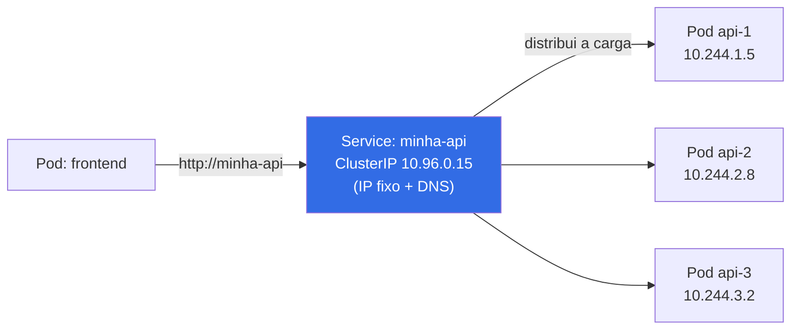
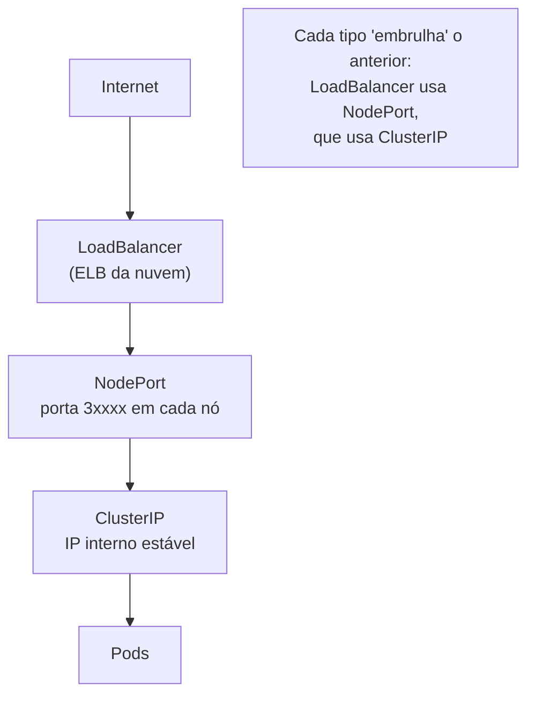
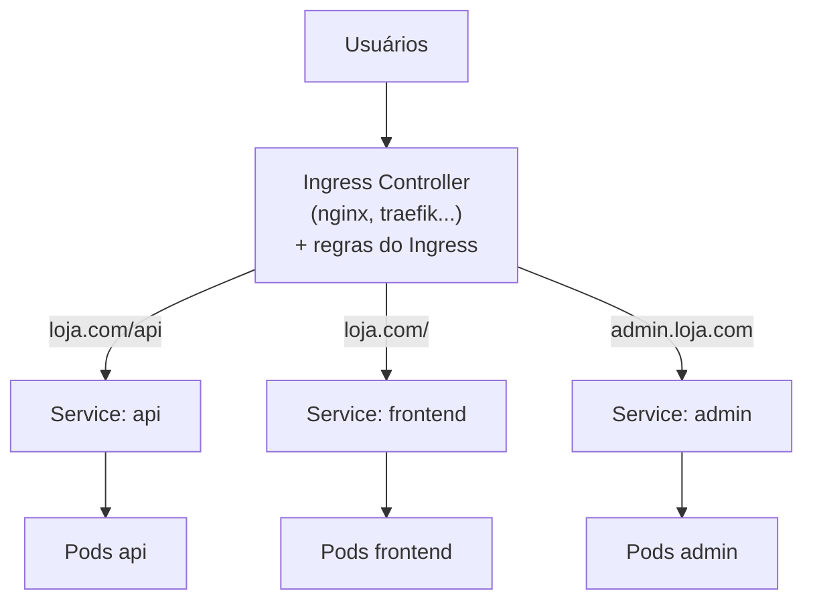

# Rede: Service, Ingress e comunicação no cluster

> **Objetivo deste arquivo:** entender **como aplicações se comunicam dentro do cluster**, como o tráfego externo chega até elas e **como o Kubernetes faz balanceamento de carga** — através de **Services** e **Ingress**.

---

## 1. O problema: Pods têm IPs instáveis

Pods morrem e renascem com **IP novo** o tempo todo. Se o frontend apontasse para o IP de um Pod do backend, quebraria a cada substituição.

**Analogia:** funcionários de uma empresa trocam de ramal toda semana. Solução? Um **número fixo da central telefônica** que sempre encaminha para quem estiver de plantão. Esse número fixo é o **Service**.

## 2. Service: nome e IP estáveis + balanceamento de carga

Um **Service** agrupa Pods (via **labels/selectors** — veja `05-organizacao-labels-namespaces.md`) e oferece:

- Um **IP virtual estável** (ClusterIP) e um **nome DNS** (`minha-api.default.svc.cluster.local`);
- **Balanceamento de carga** automático entre os Pods do grupo.



### Como o balanceamento funciona por baixo dos panos?

1. O Service mantém uma lista de **Endpoints** (os IPs dos Pods saudáveis que casam com o selector);
2. O **kube-proxy** em cada nó programa regras de rede (iptables/IPVS) que redirecionam o tráfego do IP do Service para um dos Pods, distribuindo as conexões;
3. Pods que morrem saem da lista automaticamente; novos entram sozinhos.

### Tipos de Service

| Tipo | O que faz | Analogia | Quando usar |
|---|---|---|---|
| **ClusterIP** (padrão) | IP acessível **só dentro** do cluster | Ramal interno da empresa | Comunicação entre serviços |
| **NodePort** | Abre uma porta (30000–32767) em **todos os nós** | Porta dos fundos com número conhecido | Testes, clusters locais |
| **LoadBalancer** | Provisiona um balanceador **externo** da nuvem (ELB na AWS) | Recepção com endereço público | Expor serviço em produção na nuvem |
| **ExternalName** | Apelido DNS para um serviço fora do cluster | Contato salvo na agenda | Apontar para banco externo, API de terceiros |



## 3. Ingress: o roteador HTTP de entrada

Com só Services do tipo LoadBalancer, cada serviço exposto criaria **um balanceador pago** na nuvem. O **Ingress** resolve isso: **um único ponto de entrada HTTP/HTTPS** que roteia por domínio e caminho.

**Analogia:** o Ingress é a **recepcionista do prédio comercial** — o prédio tem **uma entrada só**, e ela direciona cada visitante: "Consulta médica? 3º andar. Advogado? 5º andar." Sem ela, cada escritório precisaria de porta própria para a rua (um LoadBalancer cada).



**Importante:** o recurso `Ingress` é só a **regra** (o crachá com as instruções). Para funcionar, o cluster precisa de um **Ingress Controller** instalado (a recepcionista de fato) — ex.: NGINX Ingress Controller, Traefik, AWS Load Balancer Controller.

### Exemplo de manifesto

```yaml
apiVersion: networking.k8s.io/v1
kind: Ingress
metadata:
  name: loja
spec:
  rules:
    - host: loja.com
      http:
        paths:
          - path: /api
            pathType: Prefix
            backend:
              service:
                name: api
                port:
                  number: 8080
          - path: /
            pathType: Prefix
            backend:
              service:
                name: frontend
                port:
                  number: 80
```

## 4. Como aplicações se comunicam dentro do cluster? (resumo)

- Todo Pod enxerga todo Pod (modelo de rede plano do Kubernetes);
- Mas na prática, sempre via **Service + DNS**: o frontend chama `http://minha-api:8080`, não um IP;
- O DNS interno (**CoreDNS**) resolve `minha-api` para o ClusterIP do Service;
- Entre namespaces: `http://minha-api.outro-namespace`.


*Diagrama oficial do tutorial "Kubernetes Basics": Services (contornos coloridos) agrupando Pods entre os Nodes e expondo o tráfego. O fluxo com Ingress está no diagrama Mermaid da seção 3; a explicação das colunas do `kubectl get svc` está em [`../05-comandos/01-kubectl-essencial.md`](../05-comandos/01-kubectl-essencial.md).*

---

## Checklist de compreensão

- [ ] Por que não se conecta diretamente ao IP de um Pod?
- [ ] Como um Service sabe para quais Pods mandar tráfego?
- [ ] Qual a diferença entre ClusterIP, NodePort e LoadBalancer?
- [ ] Por que usar Ingress em vez de vários Services LoadBalancer?
- [ ] Qual a diferença entre o recurso Ingress e o Ingress Controller?

## Referências oficiais

- [Services (docs oficiais)](https://kubernetes.io/docs/concepts/services-networking/service/)
- [Ingress](https://kubernetes.io/docs/concepts/services-networking/ingress/)
- [Ingress Controllers](https://kubernetes.io/docs/concepts/services-networking/ingress-controllers/)
- [DNS para Services e Pods](https://kubernetes.io/docs/concepts/services-networking/dns-pod-service/)
- [Modelo de rede do Kubernetes](https://kubernetes.io/docs/concepts/services-networking/)

## Próximo passo

Siga para [`04-configuracao-e-storage.md`](./04-configuracao-e-storage.md): como injetar configurações/segredos e persistir dados.
