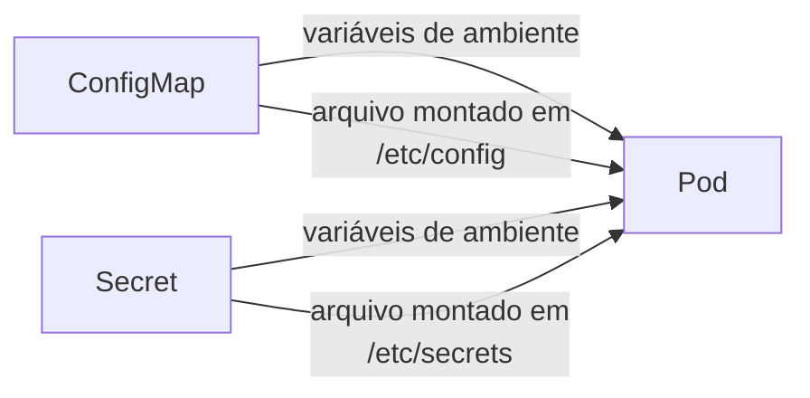
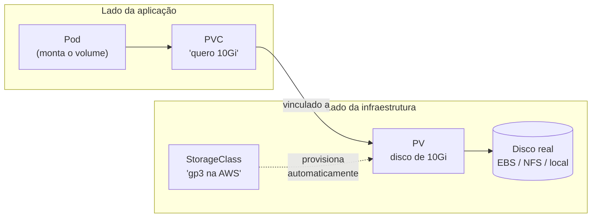

# Configuração e Armazenamento: ConfigMap, Secret, Volume, PV e PVC

> **Objetivo deste arquivo:** entender como injetar **configurações** e **segredos** nos Pods sem rebuildar imagens, e **como persistir dados em aplicações stateful** com Volumes, Persistent Volumes (PV) e Persistent Volume Claims (PVC).

---

## 1. O problema da configuração

A mesma imagem de container deve rodar em **dev, homologação e produção** mudando apenas configurações (URL do banco, feature flags, senhas). Colocar isso **dentro da imagem** é ruim: exigiria uma imagem por ambiente e exporia senhas.

**Analogia:** a imagem é um **eletrodoméstico de fábrica** — igual para todo mundo. O ConfigMap é o **manual de ajustes que você aplica na sua casa** (idioma, wi-fi, brilho). O Secret é o **cofre com a senha do wi-fi**: também é configuração, mas guardada com mais cuidado.

## 2. ConfigMap — configurações não sensíveis

```yaml
apiVersion: v1
kind: ConfigMap
metadata:
  name: api-config
data:
  DATABASE_HOST: "postgres.default.svc.cluster.local"
  LOG_LEVEL: "info"
  FEATURE_NOVO_CHECKOUT: "true"
```

## 3. Secret — dados sensíveis

Igual ao ConfigMap, mas para **senhas, tokens e chaves**. Os valores ficam codificados em **base64**.

```yaml
apiVersion: v1
kind: Secret
metadata:
  name: api-secrets
type: Opaque
data:
  DATABASE_PASSWORD: c3VwZXJzZWNyZXQ= # base64 de "supersecret"
```

**Atenção:** base64 **não é criptografia** — é só codificação (qualquer um decodifica). Em produção considere: criptografia do etcd em repouso, RBAC restrito e gerenciadores externos (AWS Secrets Manager, Vault, External Secrets Operator).

### Como o Pod consome ConfigMaps e Secrets



```yaml
# trecho do spec do container:
env:
  - name: LOG_LEVEL
    valueFrom:
      configMapKeyRef:
        name: api-config
        key: LOG_LEVEL
  - name: DATABASE_PASSWORD
    valueFrom:
      secretKeyRef:
        name: api-secrets
        key: DATABASE_PASSWORD
```

## 4. O problema do armazenamento

O sistema de arquivos de um container é **efêmero**: reiniciou, **perdeu tudo**. Para bancos de dados e uploads, isso é inaceitável.

**Analogia da escala de armazenamento:**

- **Sistema de arquivos do container** = anotar no **quadro branco** da sala de reunião: quando a reunião acaba (container reinicia), alguém apaga.
- **Volume (emptyDir)** = **caderno compartilhado da equipe durante o projeto**: sobrevive a trocas de participantes (restart de container), mas é descartado quando o projeto acaba (Pod morre).
- **Persistent Volume** = o **arquivo morto do prédio**: existe independente de qualquer equipe ou projeto; os dados ficam lá mesmo que todos os Pods morram.

## 5. Volume, PV e PVC

### Os três conceitos

| Recurso | O que é | Analogia |
|---|---|---|
| **Volume** | Diretório acessível aos containers do Pod; vida atrelada ao Pod (tipos: `emptyDir`, `configMap`, `hostPath`...) | Caderno do projeto |
| **PersistentVolume (PV)** | Um "pedaço de disco" real disponível no cluster (EBS na AWS, NFS, disco local), com vida **independente** de Pods | Uma vaga no arquivo morto |
| **PersistentVolumeClaim (PVC)** | O **pedido** de armazenamento feito pela aplicação: "preciso de 10Gi com leitura/escrita" | O requerimento pedindo uma vaga no arquivo morto |

### Por que separar PV e PVC?

**Separação de papéis:** quem desenvolve a aplicação só diz **o que precisa** (PVC); quem administra a infraestrutura decide **de onde vem** o disco (PV). Com **StorageClass**, o cluster cria o PV **automaticamente** quando surge um PVC (provisionamento dinâmico) — na AWS, por exemplo, um volume EBS é criado sozinho.



### Exemplo: PVC + uso no Pod

```yaml
apiVersion: v1
kind: PersistentVolumeClaim
metadata:
  name: dados-postgres
spec:
  accessModes: ["ReadWriteOnce"]
  storageClassName: gp3
  resources:
    requests:
      storage: 10Gi
---
# trecho do spec do Pod:
# volumes:
# - name: dados
# persistentVolumeClaim:
# claimName: dados-postgres
# containers[0].volumeMounts:
# - name: dados
# mountPath: /var/lib/postgresql/data
```

### Como persistir dados em aplicações stateful? (resposta direta)

1. Use um **StatefulSet** (veja [`02-workloads.md`](./02-workloads.md)) — ele cria **um PVC por réplica** automaticamente (`volumeClaimTemplates`);
2. Cada Pod (`db-0`, `db-1`...) monta **seu próprio** PV;
3. Se o Pod morre e renasce (até em outro nó), ele **reencontra o mesmo disco**.
---

## Checklist de compreensão

- [ ] Por que configurações não devem ficar dentro da imagem?
- [ ] Qual a diferença entre ConfigMap e Secret? Base64 protege o Secret?
- [ ] Qual a diferença de ciclo de vida entre Volume, PV e o filesystem do container?
- [ ] Qual o papel do PVC? Por que ele existe separado do PV?
- [ ] Como um StatefulSet garante que cada réplica tenha seu próprio disco?

## Referências oficiais

- [ConfigMaps (docs oficiais)](https://kubernetes.io/docs/concepts/configuration/configmap/)
- [Secrets](https://kubernetes.io/docs/concepts/configuration/secret/)
- [Volumes](https://kubernetes.io/docs/concepts/storage/volumes/)
- [Persistent Volumes](https://kubernetes.io/docs/concepts/storage/persistent-volumes/)
- [Storage Classes](https://kubernetes.io/docs/concepts/storage/storage-classes/)

## Próximo passo

Siga para [`05-organizacao-labels-namespaces.md`](./05-organizacao-labels-namespaces.md): como organizar e "etiquetar" tudo isso.
