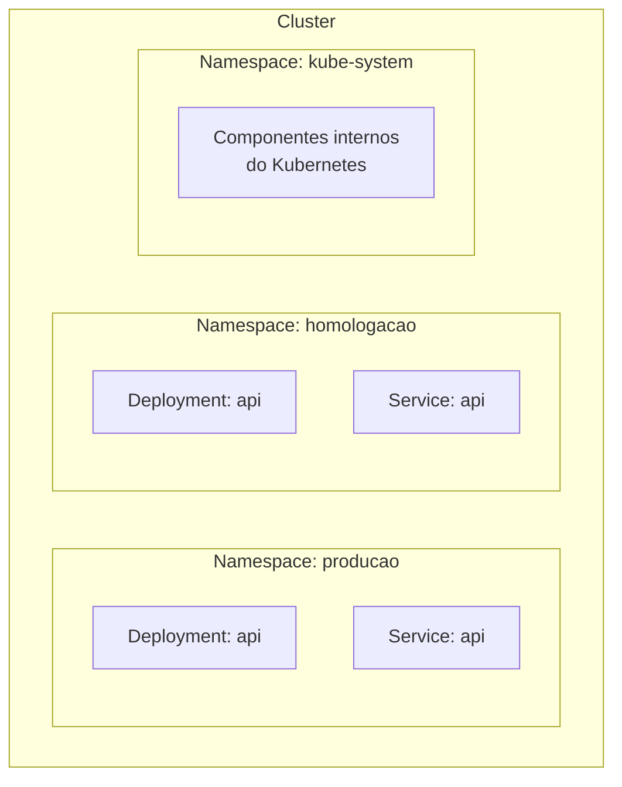
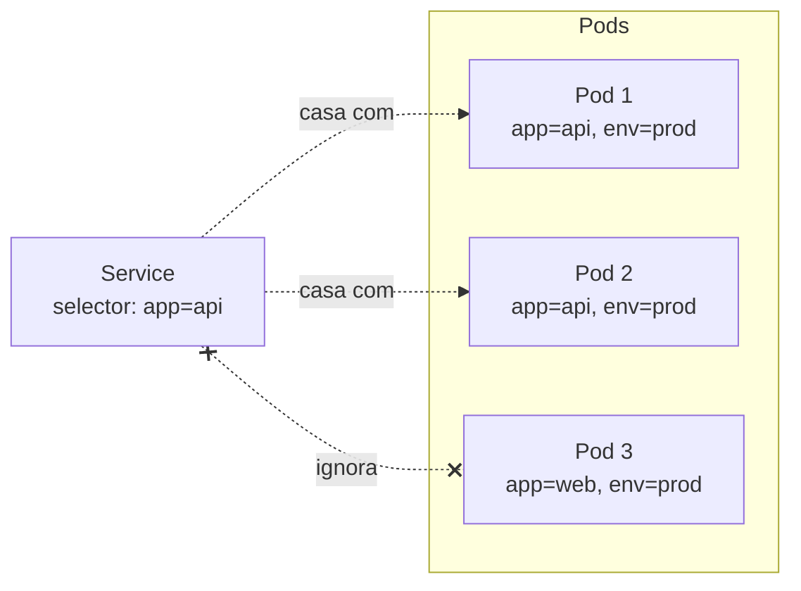
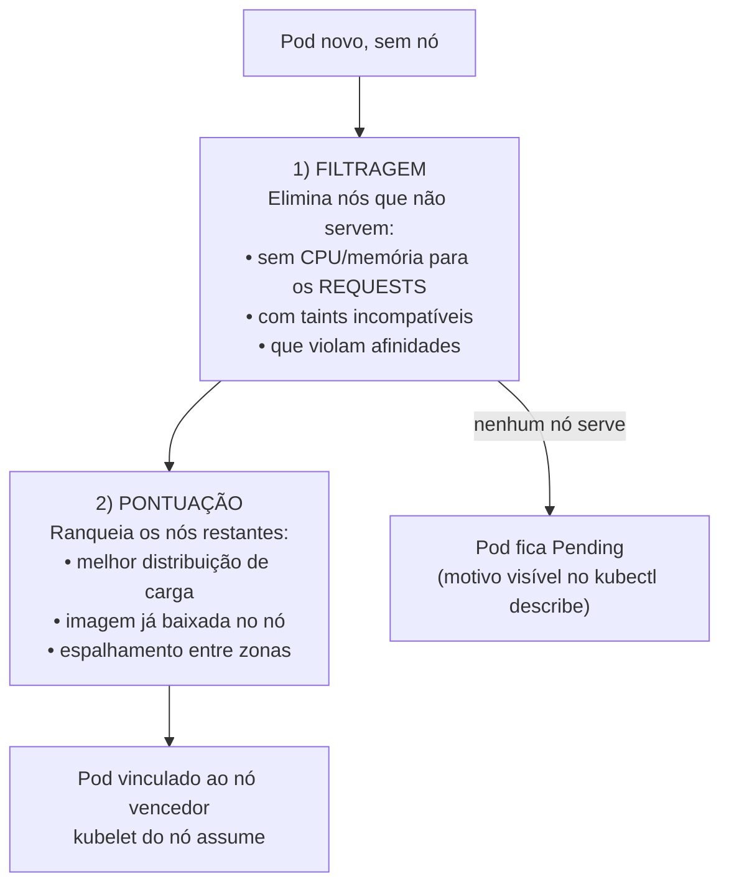

# Organização: Namespaces, Labels, Selectors, Requests e Limits

> **Objetivo deste arquivo:** entender como **organizar** os recursos do cluster (Namespaces), como o Kubernetes **conecta** recursos entre si (Labels e Selectors) e como declarar **quanto de CPU/memória** cada container precisa (Requests e Limits) — informação que alimenta o **Scheduler**.

---

## 1. Namespace — os "departamentos" do cluster

Um **Namespace** é uma divisão lógica do cluster: agrupa recursos, isola nomes e permite aplicar cotas e permissões por grupo.

**Analogia:** o cluster é um **prédio comercial** e cada Namespace é um **andar/empresa**. Duas empresas podem ter um funcionário chamado "João" (dois Services chamados `api`) sem conflito, porque estão em andares diferentes. A administração do prédio pode limitar a energia de cada andar (ResourceQuota) e controlar quem entra em qual andar (RBAC).



Namespaces que já vêm criados:

| Namespace | Para que serve |
|---|---|
| `default` | Onde os recursos caem se você não especificar nada |
| `kube-system` | Componentes do próprio Kubernetes (CoreDNS, kube-proxy...) — **não mexa** |
| `kube-public` | Recursos legíveis por todos (raramente usado) |
| `kube-node-lease` | Sinais de vida (heartbeats) dos nós |

Usos comuns: separar **ambientes** (`producao`, `homologacao`), **times** (`time-pagamentos`, `time-busca`) ou **produtos**.

## 2. Labels e Selectors — as etiquetas que conectam tudo

**Labels** são pares chave/valor colados em qualquer recurso. **Selectors** são filtros sobre essas etiquetas. É assim que o Kubernetes conecta as peças: **nada se conecta por nome, tudo se conecta por labels**.

**Analogia:** uma **biblioteca** — os livros (Pods) recebem etiquetas ("ficção", "autor-X", "século-XX"). Quando alguém pede "todos os livros de ficção do século XX" (selector), a bibliotecária junta o grupo na hora, sem lista fixa. Livro novo com as etiquetas certas entra no grupo automaticamente.



É por isso que no Deployment o `spec.selector.matchLabels` **precisa casar** com o `spec.template.metadata.labels` — é assim que ele "reconhece" os Pods que são dele.

```bash
# na prática, filtrar por label é o dia a dia:
kubectl get pods -l app=api
kubectl get pods -l 'env in (prod, staging)'
```

Convenções recomendadas de labels (oficiais): `app.kubernetes.io/name`, `app.kubernetes.io/version`, `app.kubernetes.io/component`.

## 3. Requests e Limits — o contrato de recursos

Cada container pode (e deve!) declarar:

- **Request** = o **mínimo garantido** que ele precisa. O **Scheduler usa esse valor** para decidir em qual nó o Pod cabe.
- **Limit** = o **teto** que ele pode usar. Passou do limite de memória → o container é morto (**OOMKilled**); passou do de CPU → é **estrangulado** (throttling), mas não morto.

**Analogia:** reserva num **restaurante** — o *request* é a **mesa reservada para 4 pessoas**: está garantida, mesmo que só 2 apareçam. O *limit* é o **máximo de cadeiras que o garçom deixa você juntar**: pediu uma 9ª cadeira além do limite? Não pode (CPU) ou o gerente encerra a festa (memória).

```yaml
# trecho do spec do container:
resources:
  requests:
    cpu: "250m" # 0,25 núcleo — usado pelo Scheduler
    memory: "256Mi"
  limits:
    cpu: "500m" # teto: 0,5 núcleo (excedeu -> throttling)
    memory: "512Mi" # teto: excedeu -> OOMKilled
```

Unidades: CPU em **millicores** (`1000m` = 1 núcleo); memória em `Mi`/`Gi`.

## 4. Scheduler — o "corretor de imóveis" dos Pods

O **kube-scheduler** (apresentado em [`../01-fundamentos/02-arquitetura-cluster.md`](../01-fundamentos/02-arquitetura-cluster.md)) decide **em qual nó** cada Pod novo roda, em duas fases:



**Analogia:** um **corretor de imóveis** — primeiro descarta os imóveis que não atendem os requisitos inegociáveis do cliente (número de quartos = requests), depois ranqueia os que sobraram (preço, localização) e fecha com o melhor. Se **nenhum** imóvel serve, o cliente fica na fila de espera (`Pending`).


*Diagrama oficial do tutorial "Kubernetes Basics": labels (s: app=A / app=B) nos Pods e o Service selecionando por elas.*
---

## Checklist de compreensão

- [ ] Para que servem Namespaces? Cite 2 usos práticos.
- [ ] Como um Service sabe quais Pods são dele?
- [ ] Qual a diferença entre request e limit? O que acontece ao exceder cada um?
- [ ] Qual valor o Scheduler usa para decidir se um Pod cabe num nó?
- [ ] O que significa um Pod preso em `Pending`?

## Referências oficiais

- [Namespaces (docs oficiais)](https://kubernetes.io/docs/concepts/overview/working-with-objects/namespaces/)
- [Labels e Selectors](https://kubernetes.io/docs/concepts/overview/working-with-objects/labels/)
- [Labels recomendadas](https://kubernetes.io/docs/concepts/overview/working-with-objects/common-labels/)
- [Gerenciamento de recursos (requests/limits)](https://kubernetes.io/docs/concepts/configuration/manage-resources-containers/)
- [kube-scheduler](https://kubernetes.io/docs/concepts/scheduling-eviction/kube-scheduler/)

## Próximo passo

Conceitos básicos concluídos! Siga para [`../03-funcionamento/01-auto-healing-e-escalabilidade.md`](../03-funcionamento/01-auto-healing-e-escalabilidade.md) para ver o Kubernetes **em ação**.
