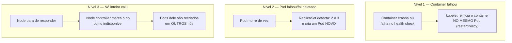
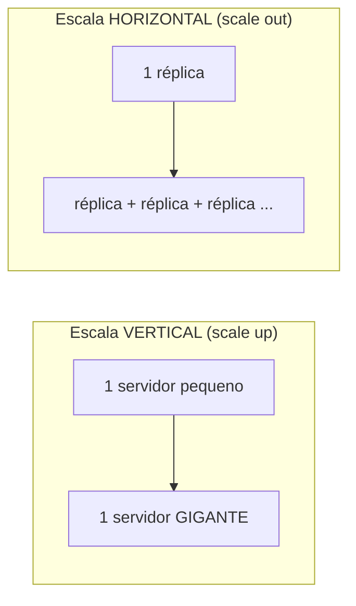
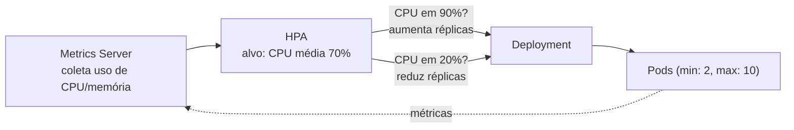
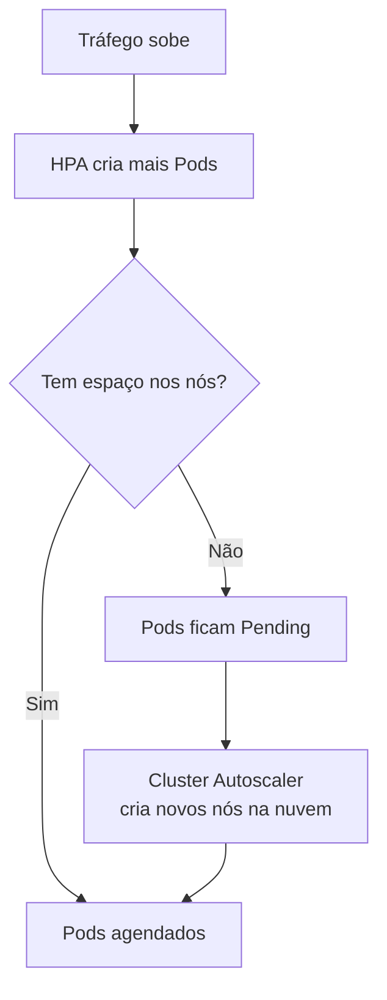

# Auto Healing e Escalabilidade Horizontal

> **Objetivo deste arquivo:** responder na prática: **como ocorre o auto healing** (reinício e substituição de containers) e **como funciona a escalabilidade horizontal**.

---

## 1. Auto Healing — o cluster que se cura sozinho

O auto healing é consequência direta do **loop de reconciliação** (visto em [`../01-fundamentos/01-por-que-kubernetes.md`](../01-fundamentos/01-por-que-kubernetes.md)): o estado desejado diz "3 réplicas saudáveis"; qualquer coisa diferente disso é corrigida automaticamente.

**Analogia:** um **sistema imunológico** — você não "manda" o corpo cicatrizar um corte; ele detecta o dano e age sozinho. No Kubernetes, ninguém precisa acordar às 3h da manhã para reiniciar um serviço.

### Os 3 níveis de cura



| Nível | Quem detecta | Quem corrige | O que acontece |
|---|---|---|---|
| Container | kubelet (no nó) | kubelet | Reinicia o container no mesmo Pod (mesmo IP) |
| Pod | ReplicaSet controller | ReplicaSet | Cria um Pod **novo** (nome e IP novos) |
| Node | Node controller | Scheduler + ReplicaSet | Pods realocados para outros nós (após ~5 min por padrão) |

### Como o Kubernetes sabe se a aplicação está saudável? Probes!

O processo pode estar "vivo" mas travado (deadlock) ou ainda inicializando. Para isso existem os **health checks (probes)**:

| Probe | Pergunta que responde | Se falhar | Analogia |
|---|---|---|---|
| **Liveness** | "Você está vivo?" | Container é **reiniciado** | Enfermeira checando pulso: sem pulso → desfibrilador (restart) |
| **Readiness** | "Você está pronto para atender?" | Pod **sai do balanceamento** do Service (não morre) | Atendente com a plaquinha "volto já": continua no balcão, mas a fila não é direcionada a ele |
| **Startup** | "Você já terminou de inicializar?" | Segura as outras probes até a app subir | Não cobrar o restaurante antes de ele abrir as portas |

```yaml
# trecho do spec do container:
livenessProbe:
  httpGet:
    path: /healthz
    port: 8080
  periodSeconds: 10
readinessProbe:
  httpGet:
    path: /ready
    port: 8080
  periodSeconds: 5
```

**Sem readiness probe**, o Kubernetes começa a mandar tráfego para o Pod **assim que o container inicia** — mesmo que sua aplicação ainda esteja subindo. É uma das causas mais comuns de erros 502 durante deploys.

---

## 2. Escalabilidade horizontal

### Vertical × Horizontal



**Analogia:** um caixa de supermercado com fila crescendo. **Vertical** = treinar o caixa para ser 3× mais rápido (tem limite físico e, se ele adoecer, tudo para). **Horizontal** = **abrir mais caixas** (sem limite prático e a falha de um não derruba o serviço). O Kubernetes foi desenhado para a horizontal.

### Escala manual

```bash
kubectl scale deployment minha-api --replicas=10
```

### Escala automática — HPA (Horizontal Pod Autoscaler)

O **HPA** ajusta o número de réplicas automaticamente com base em métricas (CPU, memória ou métricas customizadas como requisições/segundo):



```yaml
apiVersion: autoscaling/v2
kind: HorizontalPodAutoscaler
metadata:
  name: minha-api
spec:
  scaleTargetRef:
    apiVersion: apps/v1
    kind: Deployment
    name: minha-api
  minReplicas: 2
  maxReplicas: 10
  metrics:
    - type: Resource
      resource:
        name: cpu
        target:
          type: Utilization
          averageUtilization: 70
```

**Analogia:** o **gerente do supermercado** olhando as filas: passou de 7 clientes por caixa (70% de CPU), abre mais caixas; movimento caiu, fecha alguns — sempre respeitando o mínimo (2 caixas abertos) e o máximo (10 caixas existentes).

O HPA depende do **Metrics Server** instalado e de **requests de CPU/memória declarados** nos containers (é sobre o request que a % é calculada) — mais um motivo para o que foi visto em [`../02-conceitos-basicos/05-organizacao-labels-namespaces.md`](../02-conceitos-basicos/05-organizacao-labels-namespaces.md).

### E quando faltam nós? Cluster Autoscaler

Se o HPA quer 10 réplicas mas os nós estão cheios, os Pods ficam `Pending`. O **Cluster Autoscaler** (ou **Karpenter**, na AWS) detecta isso e **adiciona nós** ao cluster — é o supermercado **construindo mais espaço** quando nem abrindo todos os caixas dá conta.




*Diagramas oficiais do tutorial "Kubernetes Basics": antes e depois da escala horizontal — o Service passa a distribuir o tráfego entre as novas réplicas automaticamente.*
---

## Checklist de compreensão

- [ ] Quais são os 3 níveis de auto healing e quem age em cada um?
- [ ] Qual a diferença entre liveness e readiness probe?
- [ ] Por que escala horizontal é preferível à vertical em sistemas distribuídos?
- [ ] O que o HPA precisa para funcionar?
- [ ] O que acontece quando o HPA quer mais Pods do que os nós comportam?

## Referências oficiais

- [Probes: liveness, readiness e startup](https://kubernetes.io/docs/tasks/configure-pod-container/configure-liveness-readiness-startup-probes/)
- [Horizontal Pod Autoscaler](https://kubernetes.io/docs/tasks/run-application/horizontal-pod-autoscale/)
- [Metrics Server](https://github.com/kubernetes-sigs/metrics-server)
- [Cluster Autoscaler](https://github.com/kubernetes/autoscaler)
- [Karpenter (AWS)](https://karpenter.sh/)

## Próximo passo

Siga para [`02-deploy-sem-downtime.md`](./02-deploy-sem-downtime.md): como atualizar a aplicação sem derrubar ninguém.
