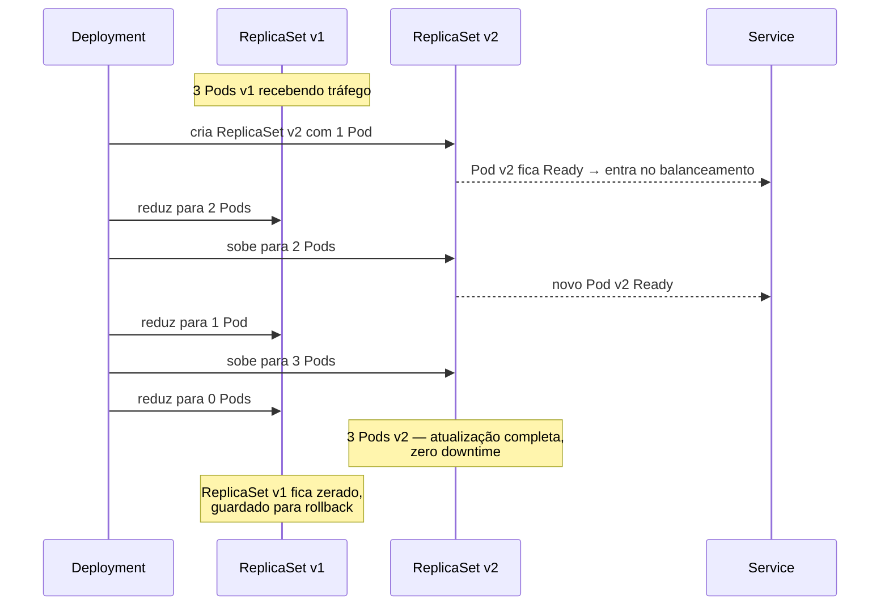
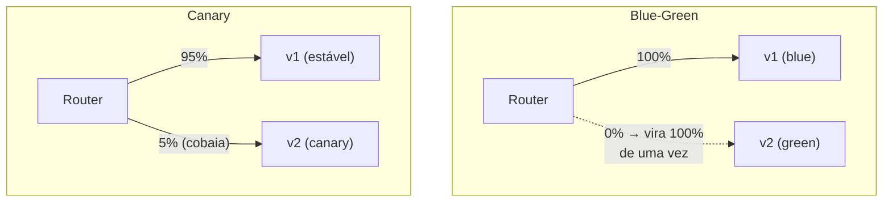

# Deploy e Atualização sem Downtime

> **Objetivo deste arquivo:** responder: **como acontece o processo de deploy e atualização sem downtime?** — rolling updates, rollbacks e as principais estratégias de deploy.

---

## 1. O problema

No mundo "1 servidor + 1 aplicação", atualizar significava: parar o serviço, trocar a versão, subir de novo → **janela de indisponibilidade**, geralmente de madrugada. O Kubernetes torna isso desnecessário.

**Analogia:** trocar os pneus de um carro **em movimento** — ou melhor: uma **frota de táxis**. Você não para todos os táxis para trocar de modelo; coloca os modelos novos na rua aos poucos e recolhe os antigos conforme os novos provam que funcionam. Passageiros nunca ficam sem táxi.

## 2. Rolling Update — a estratégia padrão do Deployment

Quando você muda a imagem de um Deployment (ex.: `v1` → `v2`), ele **não mata tudo e recria**. Ele cria um **novo ReplicaSet** e transfere gradualmente:



### Controlando o ritmo

```yaml
spec:
  strategy:
    type: RollingUpdate
    rollingUpdate:
      maxUnavailable: 1 # no máx. 1 Pod a menos que o desejado durante o deploy
      maxSurge: 1 # no máx. 1 Pod a mais que o desejado durante o deploy
```

### Pré-requisitos reais para "zero downtime"

O rolling update sozinho **não garante** zero downtime. Você também precisa de:

1. **Readiness probe** configurada — sem ela, o tráfego chega ao Pod novo antes de a aplicação estar pronta (erros 502);
2. **Graceful shutdown** — a aplicação deve tratar o sinal `SIGTERM` e terminar as requisições em andamento antes de encerrar;
3. **Mais de 1 réplica** — com 1 réplica e `maxUnavailable: 1`, há um instante sem ninguém atendendo.

## 3. Rollback — o botão de desfazer

O Deployment guarda o histórico de ReplicaSets. Se a v2 estiver quebrada:

```bash
kubectl rollout status deployment/minha-api # acompanhar o deploy
kubectl rollout history deployment/minha-api # ver o histórico de revisões
kubectl rollout undo deployment/minha-api # voltar para a versão anterior
```

O rollback é **outro rolling update**, só que na direção contrária — igualmente sem downtime.

## 4. Outras estratégias de deploy (visão geral)

| Estratégia | Como funciona | Analogia | Trade-off |
|---|---|---|---|
| **Rolling update** (padrão) | Troca gradual de Pods | Frota de táxis renovada aos poucos | Simples; v1 e v2 convivem por um tempo |
| **Recreate** | Mata tudo, sobe a versão nova | Fechar a loja para reforma | **Tem downtime**; útil quando versões não podem coexistir |
| **Blue-Green** | Dois ambientes completos (azul = atual, verde = novo); vira o tráfego de uma vez | Construir a loja nova ao lado e trocar a placa da entrada | Rollback instantâneo; custa 2× recursos durante a troca |
| **Canary** | Manda uma fração pequena do tráfego (ex.: 5%) para a versão nova e observa | O **canário na mina de carvão**: um "sentinela" testa o ambiente antes de todos entrarem | Mais seguro; exige ferramentas extras (Ingress avançado, Argo Rollouts, service mesh) |



> Blue-Green e Canary **não são nativos** do Deployment básico — em geral usam Ingress com pesos, [Argo Rollouts](https://argoproj.github.io/rollouts/) ou service mesh. Para a introdução, domine o rolling update; conheça os outros pelo conceito.

### O rolling update em 4 quadros (diagramas oficiais)


*Sequência oficial do tutorial "Kubernetes Basics": os Pods verdes (v1) são substituídos pelos laranjas (v2) um a um, enquanto o Service segue roteando apenas para Pods disponíveis.*
---

## Checklist de compreensão

- [ ] Descreva o passo a passo de um rolling update (envolvendo os dois ReplicaSets).
- [ ] Cite os 3 pré-requisitos para o rolling update ser realmente zero-downtime.
- [ ] Como desfazer um deploy quebrado?
- [ ] Qual a diferença entre Blue-Green e Canary?
- [ ] Quando a estratégia Recreate é aceitável?

## Referências oficiais

- [Deployments — estratégias de atualização](https://kubernetes.io/docs/concepts/workloads/controllers/deployment/#strategy)
- [Realizando um rolling update (tutorial interativo oficial)](https://kubernetes.io/docs/tutorials/kubernetes-basics/update/update-intro/)
- [kubectl rollout — referência](https://kubernetes.io/docs/reference/kubectl/generated/kubectl_rollout/)
- [Encerramento de Pods (graceful shutdown)](https://kubernetes.io/docs/concepts/workloads/pods/pod-lifecycle/#pod-termination)
- [Argo Rollouts (Blue-Green/Canary avançado)](https://argoproj.github.io/rollouts/)

## Próximo passo

Teoria concluída! Siga para [`../04-instalacao/01-formas-de-instalacao.md`](../04-instalacao/01-formas-de-instalacao.md) para colocar a mão na massa.
