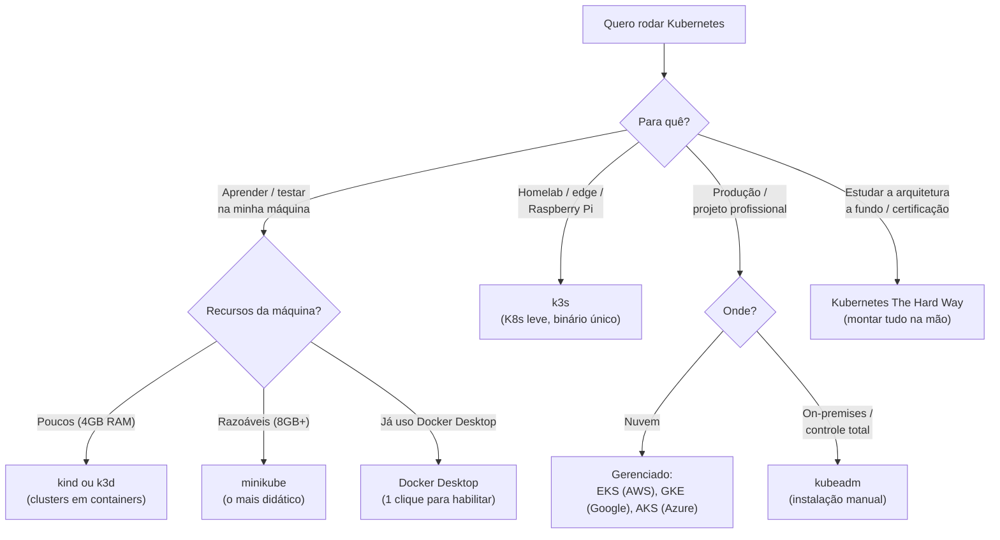
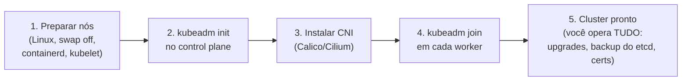

# Formas e Tipos de Instalação do Kubernetes

> **Objetivo deste arquivo:** conhecer as diferentes formas de instalar/rodar Kubernetes, **o que é preciso ter de antemão** e como escolher entre elas — do laboratório de estudos ao ambiente profissional.

---

## 1. Mapa de decisão



## 2. Pré-requisitos gerais (o que ter de antemão)

### Conhecimentos

| Pré-requisito | Por quê |
|---|---|
| **Docker/containers** | O K8s orquestra containers; sem essa base, nada fará sentido (veja a pasta `../../docker/`) |
| **Terminal/Linux básico** | Todo o dia a dia é em linha de comando |
| **YAML** | Todos os manifestos são YAML (indentação importa!) |
| **Redes básico** | IP, porta, DNS, HTTP — essencial para Services/Ingress |
| **Git** | Manifestos devem ser versionados |

### Ferramentas (instalar antes de qualquer cluster)

```bash
# kubectl — o cliente oficial (obrigatório em TODOS os cenários)
curl -LO "https://dl.k8s.io/release/$(curl -L -s https://dl.k8s.io/release/stable.txt)/bin/linux/amd64/kubectl"
sudo install -o root -g root -m 0755 kubectl /usr/local/bin/kubectl
kubectl version --client

# Um runtime de containers na máquina (para clusters locais)
docker --version
```

### Hardware mínimo (cluster local de estudos)

- 2 CPUs, 4–8 GB de RAM livres, 20 GB de disco, virtualização habilitada na BIOS (para minikube com driver de VM).

## 3. Opções para APRENDIZAGEM (local)

| Ferramenta | Como funciona | Prós | Contras |
|---|---|---|---|
| **minikube** | Cria 1 cluster em VM ou container | Mais didático; addons prontos (`ingress`, `metrics-server`, `dashboard`) | Mais pesado |
| **kind** | Clusters dentro de containers Docker | Leve, rápido, multi-node fácil; padrão em CI | Menos "conveniências" prontas |
| **k3s / k3d** | Distribuição leve da Rancher (k3d = k3s em Docker) | Muito leve; serve até para produção edge | Alguns componentes diferem do K8s "cheio" |
| **Docker Desktop** | Checkbox nas configurações | Zero esforço | 1 nó só, pouco configurável |
| **Playgrounds online** | [Killercoda](https://killercoda.com/), [Play with Kubernetes](https://labs.play-with-k8s.com/) | Nada para instalar | Sessões temporárias |

### Passo a passo: minikube (recomendado para começar)

```bash
# 1. Instalar (Linux)
curl -LO https://storage.googleapis.com/minikube/releases/latest/minikube-linux-amd64
sudo install minikube-linux-amd64 /usr/local/bin/minikube

# 2. Criar o cluster
minikube start --driver=docker --cpus=2 --memory=4096

# 3. Verificar
kubectl get nodes # deve mostrar 1 nó "Ready"
kubectl cluster-info

# 4. Addons úteis para os estudos
minikube addons enable ingress
minikube addons enable metrics-server
minikube dashboard # interface web

# 5. Dia a dia
minikube stop # pausa (preserva o estado)
minikube start # retoma
minikube delete # apaga tudo para recomeçar do zero
```

### Passo a passo: kind (alternativa leve, ótima para simular multi-node)

```bash
# 1. Instalar
go install sigs.k8s.io/kind@latest # ou baixe o binário do GitHub releases

# 2. Cluster simples
kind create cluster --name estudos

# 3. Cluster com 1 control plane + 2 workers (simula um cluster real!)
cat <<EOF | kind create cluster --name multi --config=-
kind: Cluster
apiVersion: kind.x-k8s.io/v1alpha4
nodes:
  - role: control-plane
  - role: worker
  - role: worker
EOF

kubectl get nodes # 3 nós!
```

## 4. Opções para uso PROFISSIONAL

### Nuvem gerenciada (o caminho padrão de mercado)

O provedor opera o control plane (API Server, etcd, upgrades, HA); você cuida dos workers e das aplicações.

| Provedor | Serviço | Ferramenta de criação |
|---|---|---|
| AWS | **EKS** | `eksctl`, Terraform, CDK |
| Google Cloud | **GKE** | `gcloud`, Terraform |
| Azure | **AKS** | `az`, Terraform |
| DigitalOcean/Linode | DOKS/LKE | Painel/CLI (mais baratos p/ projetos pessoais) |

Exemplo com EKS (pré-requisitos: conta AWS, `aws cli` autenticado, `eksctl` e `kubectl` instalados):

```bash
eksctl create cluster \
  --name meu-cluster \
  --region us-east-1 \
  --nodegroup-name workers \
  --node-type t3.medium \
  --nodes 2

# eksctl já configura o kubeconfig:
kubectl get nodes
```

**Custo:** EKS cobra ~US$ 0,10/hora pelo control plane + o preço das EC2 dos workers. **Delete o cluster após os testes** (`eksctl delete cluster --name meu-cluster`).

> Em empresas, o cluster nunca é criado "na mão": usa-se **infraestrutura como código** (Terraform/OpenTofu) + **GitOps** (ArgoCD/Flux) para os deploys. Guarde esses nomes para a fase de aprofundamento (`../06-plano-de-estudos/`).

### Self-managed com kubeadm (on-premises / controle total)

Você monta o cluster em máquinas próprias (ou EC2): instala container runtime + kubelet + kubeadm em cada nó, roda `kubeadm init` no control plane, instala um plugin de rede (CNI, ex.: Calico ou Cilium) e junta os workers com `kubeadm join`.



**Use quando:** requisitos de compliance/on-premises, ou como exercício de aprendizado avançado. **Evite** como primeira opção profissional se um gerenciado atende.

### Kubernetes The Hard Way (só para estudo profundo)

O tutorial do Kelsey Hightower monta cada componente manualmente, sem instaladores. Não é para produção — é para **entender de verdade** cada peça da arquitetura. Excelente preparação para a certificação CKA.

## 5. Resumo comparativo

| Cenário | Recomendação | Esforço | Custo |
|---|---|---|---|
| Primeiro contato / este curso | **minikube** ou **kind** | Baixo | R$ 0 |
| Máquina fraca / CI | **kind** ou **k3d** | Baixo | R$ 0 |
| Projeto pessoal exposto na internet | **k3s em um VPS** ou DOKS/LKE | Médio | Baixo |
| Empresa na AWS | **EKS** (+ Terraform + GitOps) | Médio | US$ 72+/mês só o control plane |
| On-premises / compliance | **kubeadm** (ou OpenShift/Rancher) | Alto | Hardware + time |
| Estudo da arquitetura / CKA | **Kubernetes The Hard Way** | Muito alto | R$ 0 (ou créditos cloud) |
---

## Checklist de compreensão

- [ ] O que é obrigatório instalar em qualquer cenário (local ou nuvem)?
- [ ] Qual a diferença entre minikube e kind?
- [ ] No EKS, o que a AWS gerencia e o que continua sendo problema seu?
- [ ] Em que situação kubeadm faz sentido?
- [ ] Por que "The Hard Way" existe se ninguém o usa em produção?

## Referências oficiais

- [Instalando o kubectl](https://kubernetes.io/docs/tasks/tools/)
- [minikube — documentação oficial](https://minikube.sigs.k8s.io/docs/start/)
- [kind — documentação oficial](https://kind.sigs.k8s.io/docs/user/quick-start/)
- [k3s](https://docs.k3s.io/)
- [Criando um cluster com kubeadm](https://kubernetes.io/docs/setup/production-environment/tools/kubeadm/create-cluster-kubeadm/)
- [eksctl / Amazon EKS getting started](https://docs.aws.amazon.com/eks/latest/userguide/getting-started-eksctl.html)
- [Kubernetes The Hard Way (Kelsey Hightower)](https://github.com/kelseyhightower/kubernetes-the-hard-way)

## Próximo passo

Cluster no ar? Siga para [`../05-comandos/01-kubectl-essencial.md`](../05-comandos/01-kubectl-essencial.md) e aprenda os comandos do dia a dia.
