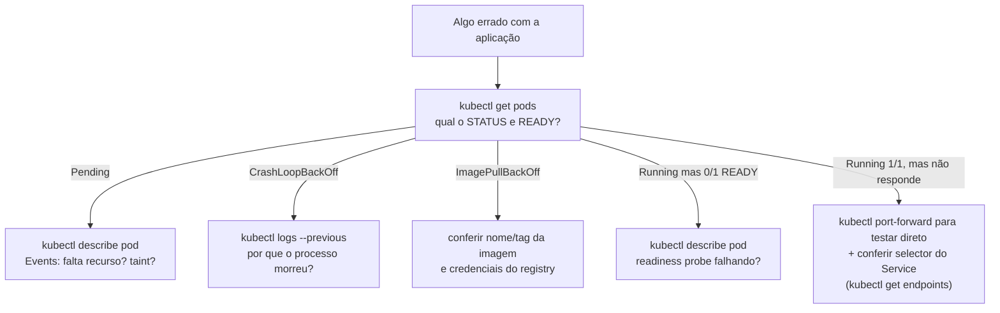

# kubectl Essencial: comandos, retornos e colunas explicadas

> **Objetivo deste arquivo:** catálogo dos **principais comandos básicos** desta introdução: para que cada um serve, **qual o tipo de retorno** e, quando o retorno é uma listagem, **o que cada coluna significa**.

---

## 0. Anatomia de um comando kubectl

```
kubectl <verbo> <tipo-de-recurso> [nome] [flags]
kubectl get pods minha-api -n producao -o wide
```

**Analogia:** falar com o kubectl é como pedir num balcão: **verbo** (o que fazer: ver, criar, apagar), **recurso** (com o quê: pods, services...), **nome** (qual especificamente) e **flags** (detalhes do pedido).

Flags que funcionam em quase tudo:

| Flag | Efeito |
|---|---|
| `-n <namespace>` | Age no namespace indicado (sem ela: `default`) |
| `-A` ou `--all-namespaces` | Age em todos os namespaces |
| `-o wide` | Listagem com colunas extras |
| `-o yaml` / `-o json` | Retorna o objeto completo (ótimo para estudar a estrutura) |
| `-l chave=valor` | Filtra por label |
| `-w` | *Watch*: fica observando mudanças em tempo real |

---

## 1. Comandos de contexto e cluster

### `kubectl version`
- **Serve para:** ver a versão do cliente (kubectl) e do servidor (cluster).
- **Retorno:** texto com as duas versões. Diferença maior que ±1 versão minor entre client/server pode causar incompatibilidades.

### `kubectl cluster-info`
- **Serve para:** confirmar a qual cluster você está conectado e onde está o control plane.
- **Retorno:** URLs do API Server e do CoreDNS.

### `kubectl config get-contexts` / `kubectl config use-context <nome>`
- **Serve para:** listar e trocar entre clusters/contextos configurados no seu `~/.kube/config` (ex.: minikube × EKS).
- **Retorno da listagem:**

| Coluna | Significado |
|---|---|
| `CURRENT` | `*` marca o contexto ativo (para onde seus comandos vão!) |
| `NAME` | Nome do contexto |
| `CLUSTER` | Cluster ao qual o contexto aponta |
| `AUTHINFO` | Credencial/usuário utilizado |
| `NAMESPACE` | Namespace padrão desse contexto (vazio = `default`) |

**Sempre confira o contexto antes de aplicar/deletar qualquer coisa** — é o erro clássico de rodar comando no cluster errado.

---

## 2. Consultando recursos: `kubectl get`

- **Serve para:** listar recursos de um tipo. É o comando que você mais vai digitar na vida.
- **Retorno:** tabela (uma linha por recurso).

### `kubectl get nodes`

```
NAME STATUS ROLES AGE VERSION
minikube Ready control-plane 10d v1.30.0
```

| Coluna | Significado |
|---|---|
| `NAME` | Nome do nó (hostname da máquina) |
| `STATUS` | `Ready` = apto a receber Pods; `NotReady` = com problema (rede, kubelet, disco); `SchedulingDisabled` = marcado para não receber Pods novos (cordon) |
| `ROLES` | `control-plane` (gerência) e/ou `<none>`/`worker` |
| `AGE` | Há quanto tempo o nó está no cluster |
| `VERSION` | Versão do kubelet naquele nó |

Com `-o wide`, ganha: `INTERNAL-IP`, `EXTERNAL-IP`, `OS-IMAGE`, `KERNEL-VERSION`, `CONTAINER-RUNTIME` (ex.: `containerd://1.7`).

### `kubectl get pods`

```
NAME READY STATUS RESTARTS AGE
minha-api-7f9d5b6c4-x2k1p 1/1 Running 0 2d
minha-api-7f9d5b6c4-9qwzt 0/1 CrashLoopBackOff 12 (2m ago) 1h
```

| Coluna | Significado |
|---|---|
| `NAME` | Nome do Pod. Repare no padrão `deployment`-`hash do replicaset`-`sufixo aleatório` — dá para "ler" a hierarquia no nome |
| `READY` | `containers prontos / containers totais` no Pod. `1/1` = ok; `0/1` = o container não passou na readiness probe ou não subiu |
| `STATUS` | Fase/situação atual — ver tabela abaixo |
| `RESTARTS` | Quantas vezes os containers reiniciaram (auto healing nível 1). Número alto e crescente = problema na aplicação |
| `AGE` | Idade do Pod (Pods muito novos num Deployment antigo indicam recriação recente) |

Valores comuns de `STATUS` e o que fazer:

| STATUS | Significado | Primeiro passo de investigação |
|---|---|---|
| `Running` | Rodando | — |
| `Pending` | Sem nó atribuído ou baixando imagem | `kubectl describe pod` → seção Events |
| `ContainerCreating` | Preparando (imagem, volumes, rede) | Normal por alguns segundos; se travar, `describe` |
| `CrashLoopBackOff` | Container inicia, quebra, reinicia... em loop, com espera crescente | `kubectl logs --previous` |
| `ImagePullBackOff` / `ErrImagePull` | Não conseguiu baixar a imagem (nome errado, tag inexistente, registry privado sem credencial) | Conferir `image:` e secrets de registry |
| `OOMKilled` | Morto por exceder o limit de memória | Aumentar `limits.memory` ou corrigir vazamento |
| `Terminating` | Em processo de encerramento | Normal durante deletes/deploys |
| `Completed` | Terminou com sucesso (Jobs) | — |

Com `-o wide`, ganha: `IP` (IP do Pod), `NODE` (em qual nó está — útil para investigar problemas de um nó específico), `NOMINATED NODE`, `READINESS GATES`.

### `kubectl get deployments`

```
NAME READY UP-TO-DATE AVAILABLE AGE
minha-api 3/3 3 3 2d
```

| Coluna | Significado |
|---|---|
| `NAME` | Nome do Deployment |
| `READY` | `réplicas prontas / réplicas desejadas`. `2/3` = uma réplica com problema ou ainda subindo |
| `UP-TO-DATE` | Quantas réplicas já estão na **versão mais recente** do template (durante um rolling update esse número cresce gradualmente) |
| `AVAILABLE` | Quantas réplicas estão disponíveis para receber tráfego há tempo suficiente |
| `AGE` | Idade do Deployment |

### `kubectl get services`

```
NAME TYPE CLUSTER-IP EXTERNAL-IP PORT(S) AGE
kubernetes ClusterIP 10.96.0.1 <none> 443/TCP 10d
minha-api LoadBalancer 10.96.45.201 203.0.113.7 80:31234/TCP 2d
```

| Coluna | Significado |
|---|---|
| `NAME` | Nome do Service (vira o nome DNS interno!) |
| `TYPE` | `ClusterIP`, `NodePort`, `LoadBalancer` ou `ExternalName` |
| `CLUSTER-IP` | IP virtual interno e estável do Service |
| `EXTERNAL-IP` | IP público (só LoadBalancer). `<pending>` = a nuvem ainda está provisionando o balanceador; num cluster local fica pendente para sempre (use `minikube tunnel`) |
| `PORT(S)` | `porta-do-service:porta-no-nó/protocolo`. Em `80:31234/TCP`: 80 é a porta do Service, 31234 é o NodePort |
| `AGE` | Idade do Service |

### `kubectl get namespaces` | `kubectl get pv,pvc` | outros

O padrão se repete: `NAME`, `STATUS`, `AGE` + colunas específicas. Para PVC, as importantes são `STATUS` (`Bound` = vinculado a um PV com sucesso; `Pending` = sem PV compatível), `VOLUME`, `CAPACITY` e `STORAGECLASS`.

> Para descobrir **todos** os tipos de recursos disponíveis (e suas abreviações): `kubectl api-resources`. Abreviações úteis: `po` (pods), `svc` (services), `deploy` (deployments), `ns` (namespaces), `no` (nodes).

---

## 3. Investigando: `describe`, `logs`, `exec`

### `kubectl describe pod <nome>`
- **Serve para:** ver **tudo** sobre um recurso: configuração, estado, volumes e — a parte mais valiosa — os **Events** (o "diário de bordo": agendamento, download da imagem, falhas de probe, OOMKill...).
- **Retorno:** texto longo em seções. **Leia os Events de baixo para cima** — é o primeiro lugar para investigar qualquer problema.

### `kubectl logs <pod>`
- **Serve para:** ver o stdout/stderr do container (os "prints" da sua aplicação).
- **Retorno:** texto puro do log.
- **Variações essenciais:**

```bash
kubectl logs minha-api-x2k1p -f # acompanhar em tempo real (como tail -f)
kubectl logs minha-api-x2k1p --previous # log do container ANTERIOR (essencial em CrashLoopBackOff!)
kubectl logs minha-api-x2k1p -c sidecar # container específico de um Pod multi-container
kubectl logs deploy/minha-api # um Pod qualquer do Deployment
```

### `kubectl exec -it <pod> -- <comando>`
- **Serve para:** executar um comando **dentro** do container (como o `docker exec`).
- **Retorno:** a saída do comando; com `-it` + shell, um terminal interativo.

```bash
kubectl exec -it minha-api-x2k1p -- sh # abrir shell dentro do container
kubectl exec minha-api-x2k1p -- env # ver variáveis de ambiente injetadas
```

### `kubectl port-forward <pod|svc> <local>:<remoto>`
- **Serve para:** acessar do seu navegador/máquina um Pod ou Service interno, sem expor nada.
- **Retorno:** fica rodando segurando o túnel (Ctrl+C para encerrar).

```bash
kubectl port-forward svc/minha-api 8080:80 # http://localhost:8080 → Service
```

---

## 4. Criando e alterando: `apply`, `delete`, `scale`, `rollout`

### `kubectl apply -f <arquivo.yaml>`
- **Serve para:** criar **ou atualizar** recursos a partir de manifestos (modo **declarativo** — o jeito certo de trabalhar).
- **Retorno:** uma linha por recurso: `deployment.apps/minha-api created` | `configured` (alterado) | `unchanged`.

```bash
kubectl apply -f deployment.yaml
kubectl apply -f k8s/ # todos os YAML da pasta
```

### `kubectl delete`
- **Serve para:** remover recursos.
- **Retorno:** `pod "x" deleted`.
- Deletar um Pod de Deployment não "remove a aplicação" — o ReplicaSet cria outro (auto healing!). Para remover de verdade, delete o **Deployment**.

### `kubectl scale deployment <nome> --replicas=N`
- **Serve para:** mudar o número de réplicas manualmente.
- **Retorno:** `deployment.apps/minha-api scaled`.

### `kubectl rollout status|history|undo deployment/<nome>`
- **Serve para:** acompanhar, listar e reverter deploys (detalhes em [`../03-funcionamento/02-deploy-sem-downtime.md`](../03-funcionamento/02-deploy-sem-downtime.md)).

### `kubectl run` / `kubectl create` (modo imperativo)
- **Serve para:** criar recursos rápidos sem YAML — bom para testes, ruim para o dia a dia (nada fica versionado).

```bash
kubectl run teste --image=nginx # cria um Pod avulso
kubectl create deployment web --image=nginx --replicas=2
# truque de ouro: gerar YAML de estudo sem criar nada:
kubectl create deployment web --image=nginx --dry-run=client -o yaml > deployment.yaml
```

---

## 5. Monitorando: `top` e `get events`

### `kubectl top nodes` / `kubectl top pods`
- **Serve para:** ver consumo real de CPU/memória (requer Metrics Server).
- **Retorno (`top nodes`):**

| Coluna | Significado |
|---|---|
| `NAME` | Nome do nó/Pod |
| `CPU(cores)` | Consumo em millicores (`250m` = ¼ de núcleo) |
| `CPU%` | Percentual da capacidade do nó (só em `top nodes`) |
| `MEMORY(bytes)` | Consumo de memória (`512Mi`) |
| `MEMORY%` | Percentual da memória do nó (só em `top nodes`) |

### `kubectl get events --sort-by=.lastTimestamp`
- **Serve para:** ver o "feed de notícias" do namespace: agendamentos, falhas, restarts.
- **Retorno:** listagem com `LAST SEEN`, `TYPE` (`Normal`/`Warning`), `REASON`, `OBJECT`, `MESSAGE`.

---

## 6. Fluxo de investigação (cola para o dia a dia)


---

## Checklist de compreensão

- [ ] O que significa `READY 0/1` num Pod `Running`?
- [ ] Qual comando mostra POR QUE um Pod está `Pending`?
- [ ] Em `CrashLoopBackOff`, por que usar `logs --previous` em vez de `logs`?
- [ ] O que a coluna `UP-TO-DATE` de um Deployment mostra durante um rolling update?
- [ ] Por que deletar um Pod de um Deployment não resolve nada?

## Referências oficiais

- [Referência completa do kubectl](https://kubernetes.io/docs/reference/kubectl/)
- [Cheat sheet oficial do kubectl](https://kubernetes.io/docs/reference/kubectl/cheatsheet/)
- [Guia de troubleshooting de aplicações](https://kubernetes.io/docs/tasks/debug/debug-application/)
- [kubectl explain — documentação embutida](https://kubernetes.io/docs/reference/kubectl/generated/kubectl_explain/) (ex.: `kubectl explain pod.spec.containers`)

## Próximo passo

Base completa! Siga para [`../06-plano-de-estudos/01-plano-de-aprofundamento.md`](../06-plano-de-estudos/01-plano-de-aprofundamento.md) e trace a rota para o próximo nível.
