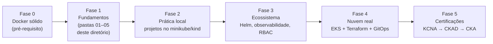
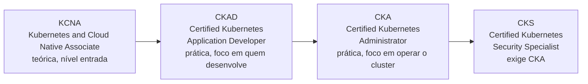

# Plano de Aprofundamento em Kubernetes

> **Objetivo deste arquivo:** transformar a base construída nas pastas anteriores em uma **rota de estudo estruturada**, com fases, projetos práticos e as principais referências oficiais.

---

## 1. A trilha completa

## 2. Fase 1 — Consolidar os fundamentos (2–4 semanas)

**Meta:** responder de cabeça todas as perguntas do checklist de cada arquivo das pastas `01` a `05`.

- [ ] Reler as anotações e completar todos os checklists de compreensão;
- [ ] Fazer os [tutoriais interativos oficiais "Kubernetes Basics"](https://kubernetes.io/docs/tutorials/kubernetes-basics/) (rodam no navegador);
- [ ] Subir um cluster local (minikube ou kind — ver `../04-instalacao/`);
- [ ] Exercício-síntese: **explicar o diagrama da arquitetura para alguém** (ou gravar um áudio). Se não conseguir explicar, ainda não entendeu.

## 3. Fase 2 — Prática deliberada local (3–6 semanas)

**Meta:** sair do "li sobre" para o "já fiz". Projetos em ordem de dificuldade:

| # | Projeto | Conceitos exercitados |
|---|---|---|
| 1 | Subir um nginx com 3 réplicas e acessar via Service | Deployment, Service, kubectl |
| 2 | App própria (API) + banco PostgreSQL | ConfigMap, Secret, StatefulSet, PVC |
| 3 | Expor tudo com Ingress e domínios locais | Ingress, Ingress Controller |
| 4 | Configurar probes, requests/limits e HPA; gerar carga e assistir escalar | Probes, HPA, Metrics Server |
| 5 | Fazer um rolling update e um rollback ao vivo com `-w` | Estratégias de deploy |
| 6 | Quebrar de propósito (imagem errada, limite baixo, probe ruim) e diagnosticar | Troubleshooting |

> O projeto 6 é o mais valioso: **quebrar e consertar** é como se aprende Kubernetes de verdade.

## 4. Fase 3 — Ecossistema essencial (4–8 semanas)

| Tema | O que é | Referência oficial |
|---|---|---|
| **Helm** | "apt-get do Kubernetes": empacota manifestos em charts reutilizáveis | <https://helm.sh/docs/> |
| **Kustomize** | Variações de manifestos por ambiente sem templates (embutido no kubectl) | <https://kustomize.io/> |
| **Observabilidade** | Prometheus (métricas) + Grafana (dashboards) + Loki (logs) | <https://prometheus.io/docs/> |
| **RBAC e segurança** | Quem pode fazer o quê no cluster; contextos de segurança de Pods | <https://kubernetes.io/docs/reference/access-authn-authz/rbac/> |
| **Network Policies** | "Firewall" entre Pods | <https://kubernetes.io/docs/concepts/services-networking/network-policies/> |
| **Operators e CRDs** | Estender o Kubernetes com recursos customizados | <https://kubernetes.io/docs/concepts/extend-kubernetes/operator/> |

## 5. Fase 4 — Nuvem e fluxo profissional (contínuo)

- [ ] Criar um cluster **EKS** com `eksctl` e depois recriá-lo com **Terraform** ( lembrar de destruir para não pagar à toa);
- [ ] Implantar via **GitOps** com **ArgoCD** (<https://argo-cd.readthedocs.io/>) ou **Flux** (<https://fluxcd.io/>): o Git como fonte da verdade do cluster;
- [ ] Montar pipeline CI/CD: build da imagem → push para o **ECR** → deploy automático;
- [ ] Estudar custos: right-sizing de requests, **Karpenter**, instâncias spot;
- [ ] Explorar os padrões AWS: EKS + Fargate, AWS Load Balancer Controller, IRSA (IAM Roles for Service Accounts).

## 6. Fase 5 — Certificações (opcional, mas direcionam o estudo)

- Página oficial das certificações (Linux Foundation/CNCF): <https://www.cncf.io/training/certification/>
- Simuladores práticos: [Killercoda](https://killercoda.com/) e [killer.sh](https://killer.sh/) (incluído na inscrição do exame).

## 7. Rotina de estudo sugerida

- **Regra 70/30:** 70% praticando no cluster, 30% lendo/assistindo;
- Sempre que ler um conceito, **rodar no cluster local** no mesmo dia;
- Manter estas anotações vivas: cada erro que você cometer e resolver vira uma nova seção nos arquivos;
- 1 projeto "quebrado de propósito" por semana (ver Fase 2, projeto 6).

## 8. Biblioteca de referências

### Oficiais (fonte da verdade)

- [Documentação do Kubernetes](https://kubernetes.io/docs/home/) — sempre comece por aqui ([parcialmente em pt-br](https://kubernetes.io/pt-br/docs/))
- [Tutoriais interativos oficiais](https://kubernetes.io/docs/tutorials/)
- [Referência da API](https://kubernetes.io/docs/reference/kubernetes-api/)
- [Blog oficial do Kubernetes](https://kubernetes.io/blog/) — mudanças e depreciações
- [CNCF Landscape](https://landscape.cncf.io/) — o mapa (gigante) do ecossistema cloud native
- [Amazon EKS — guia oficial](https://docs.aws.amazon.com/eks/latest/userguide/) e [EKS Best Practices](https://docs.aws.amazon.com/eks/latest/best-practices/)

### Aprendizado guiado

- [Kubernetes The Hard Way — Kelsey Hightower](https://github.com/kelseyhightower/kubernetes-the-hard-way)
- Livro *Kubernetes Up & Running* (O'Reilly) — dos criadores do projeto
- [Descomplicando o Kubernetes — LinuxTips](https://github.com/badtuxx/DescomplicandoKubernetes) — material aberto em português
- [Killercoda — cenários práticos gratuitos](https://killercoda.com/)

### Comunidade

- [Slack oficial do Kubernetes](https://slack.k8s.io/) (canal #kubernetes-novice)
- [r/kubernetes](https://www.reddit.com/r/kubernetes/)
- [KubeCon (palestras gratuitas no YouTube da CNCF)](https://www.youtube.com/c/cloudnativefdn)

> Dois "mapas" visuais para acompanhar o progresso (ambos interativos, melhor usar online do que como imagem estática): o [CNCF Landscape](https://landscape.cncf.io/), com todo o ecossistema cloud native, e o [roadmap.sh/kubernetes](https://roadmap.sh/kubernetes), um roadmap de estudo clicável — vá marcando as ferramentas/temas conforme for aprendendo.

---

## Como saber que estou pronto para a próxima fase?

| De → Para | Sinal de prontidão |
|---|---|
| Fase 1 → 2 | Explica arquitetura, Pod, Deployment e Service sem consultar nada |
| Fase 2 → 3 | Sobe app + banco + Ingress do zero, sem tutorial, e diagnostica um `CrashLoopBackOff` sozinho |
| Fase 3 → 4 | Empacota a app num chart Helm e tem dashboards no Grafana |
| Fase 4 → 5 | Tem um cluster na nuvem gerenciado por Git (GitOps) com pipeline completo |
