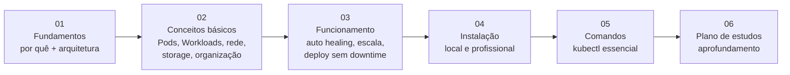

#  Meus estudos em Kubernetes

Anotações de introdução ao Kubernetes, organizadas em trilha progressiva.

## Mapa da trilha

## Índice

### [01 — Fundamentos](./01-fundamentos/)
1. [Por que Kubernetes?](./01-fundamentos/01-por-que-kubernetes.md) — servidores físicos × Docker × orquestração; o que o K8s resolve; custos e complexidades; quando (não) usar; opções na AWS (EKS, ECS, Fargate...)
2. [Arquitetura do cluster](./01-fundamentos/02-arquitetura-cluster.md) — Cluster, Node, Control Plane (API Server, Scheduler, Controller Manager, etcd), Worker Node (kubelet, kube-proxy, Container Runtime)

### [02 — Conceitos básicos](./02-conceitos-basicos/)
1. [Pods e Containers](./02-conceitos-basicos/01-pods-e-containers.md) — a menor unidade do K8s, ciclo de vida, efemeridade
2. [Workloads](./02-conceitos-basicos/02-workloads.md) — Deployment, ReplicaSet, StatefulSet, DaemonSet, Job e CronJob
3. [Rede: Services e Ingress](./02-conceitos-basicos/03-rede-services-ingress.md) — balanceamento de carga, comunicação no cluster, tipos de Service, Ingress
4. [Configuração e Storage](./02-conceitos-basicos/04-configuracao-e-storage.md) — ConfigMap, Secret, Volume, PV/PVC, persistência em apps stateful
5. [Organização](./02-conceitos-basicos/05-organizacao-labels-namespaces.md) — Namespaces, Labels/Selectors, Requests/Limits, Scheduler

### [03 — Funcionamento na prática](./03-funcionamento/)
1. [Auto healing e escalabilidade](./03-funcionamento/01-auto-healing-e-escalabilidade.md) — reinício/substituição de containers, probes, HPA, Cluster Autoscaler
2. [Deploy sem downtime](./03-funcionamento/02-deploy-sem-downtime.md) — rolling update, rollback, Blue-Green, Canary

### [04 — Instalação](./04-instalacao/)
1. [Formas de instalação](./04-instalacao/01-formas-de-instalacao.md) — pré-requisitos, minikube/kind para estudos, EKS/kubeadm para uso profissional

### [05 — Comandos](./05-comandos/)
1. [kubectl essencial](./05-comandos/01-kubectl-essencial.md) — para que serve cada comando, o que retorna e o significado de cada coluna das listagens

### [06 — Plano de estudos](./06-plano-de-estudos/)
1. [Plano de aprofundamento](./06-plano-de-estudos/01-plano-de-aprofundamento.md) — trilha em fases, projetos práticos, certificações e biblioteca de referências

## Como usar este material

- Siga a ordem das pastas — cada arquivo termina com um "próximo passo";
- Cada arquivo tem um **checklist de compreensão** ao final: só avance quando conseguir responder tudo;
- Os diagramas oficiais da documentação do Kubernetes já estão embutidos nas anotações via link público — nada precisa ser baixado ou capturado manualmente;
- As **referências oficiais** ao final de cada arquivo são a fonte da verdade — as anotações resumem, a documentação aprofunda.
